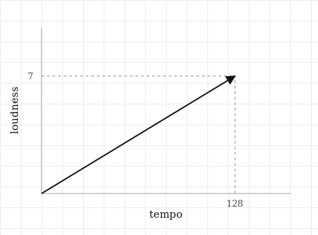

# Vectors: Arrows and Lists

## The itch {.unnumbered}

It is a calm, quiet night, and Spotify plays us a song we have never heard before. It is by a band we could not name, from a country we have never visited, sung in a language we do not speak. And somehow it fits. It settles into the evening so well that we do not reach for the phone to skip it. We just let it play.

Something chose that song for us. But that something has never heard a song in its life. It has no ears. It has never felt a bassline in its chest, never had a chorus stuck in its head on the walk home, never tied a track to a person it misses. It has no idea what music even is.

And yet it was right.

So whatever "these two songs are similar" means to that machine, it cannot mean what it means to us. It is not recognising a mood or remembering a feeling. It is doing something far more mechanical, something it can actually carry out step by step. And whatever that something is, it worked well enough that we sat there and let the song play.

That leaves us with one question, and it is the only question this chapter is about:

**What would we have to turn a song into, so that a machine could measure how close it is to another song?**

Notice that the machine does not need to describe the song, and it does not need to understand it. It only needs to measure it: to get a number out, compare that number to another, and act on the result. So whatever a song becomes in the machine, it has to be the kind of thing we can hold a ruler against and read off a value.

Turning a thing into something we can measure is the first move in all of machine learning. Every recommendation we have ever been given, every time a phone has unlocked at the sight of a face, every sentence a model has finished for us, all of it starts here. And the idea we need is smaller than we might expect.


## The picture {.unnumbered}

Let us take a single song and, just to keep things simple while we build the idea, pretend there are only two things about it we can measure: how fast it is, and how loud. Call these tempo and loudness. We write each one down as a number, and the song becomes a pair of numbers, something like 128 and 7.

That pair of numbers is a **list**, and the order is part of the deal. We agree once and for all that tempo comes first and loudness comes second, and we hold to that for every song we ever describe. Without that agreement the numbers would be ambiguous, so we treat it as a fixed rule. With the rule in place, a list is simply a set of numbers lined up in order, each sitting in a slot that means something.

Now let us draw the same song. We put tempo along a horizontal axis and loudness along a vertical one. Starting from the corner where the axes meet, we walk 128 steps to the right and then 7 steps up, and we mark where we end up. If we draw an **arrow** from the starting corner to that mark, we have turned the two numbers into something with a shape.

Look at what that arrow gives us. It points in a particular direction, and it has a particular length. Neither of those is new information we added; both came straight out of the two numbers. Walk the same steps again and we land in exactly the same place, every time.

Here is the idea the whole chapter turns on: the list and the arrow are the same object looked at in two ways. The list tells us how far to walk along each axis. The arrow is where that walk leaves us. Neither one is more real than the other, and once we have either, we can always recover the other.

If they are the same object, it is fair to ask why we bother keeping both. The answer is that each is good at something the other is not. The list is what a computer can hold, because it is nothing but numbers in memory, and numbers are all a machine has ever had to work with. The arrow is what we can think with, because no one looks at 128 and 7 and feels anything, but anyone can look at two arrows and see at a glance whether they point the same way. We keep the list for the machine and the arrow for ourselves.

Two things are worth pinning down before we move on.

The first is that the order of the numbers is not decoration. If we swap them and write 7 and 128, we now walk 7 steps right and 128 steps up, which lands us somewhere completely different and describes a song crawling along at 7 beats a minute at deafening volume. The slots carry meaning, so moving a number from one slot to another changes what the list says. This is exactly why the order has to be a rule we fix at the start.

The second is that nothing about this stops at two numbers. Add a third, say danceability, and we have three numbers and an arrow that now lives in a room rather than on a flat page. Add a fourth and we can no longer picture the arrow at all. That is a limit of our eyes, though, not a limit of the idea or of the computer. The list does not mind in the slightest; it simply gets longer. Everything we build in this book keeps working out there in the space we cannot see, which matters because that is where real data actually lives. A song on Spotify is not two numbers. It is a few hundred.

So let us return to the itch we started with. Two songs become two arrows. When the songs are alike, their arrows point in much the same direction. When they have nothing in common, their arrows point off in different directions. And how close two arrows come to pointing the same way is the kind of question that has a number for an answer, which is precisely what we were looking for.

{#fig-vector-arrow width=70%}


## The math, built up {.unnumbered}

The object we have been describing, the list that is also an arrow, has a name. We call it a **vector**. That is the whole of the word. Every vector in this book is exactly what we just built by hand: some numbers sitting in slots, and an arrow we can picture.

To work with a vector we need a way to write it down, so we give it a name and put its list in brackets:

$$
\mathbf{v} = [128, 7]
$$

The name here is $\mathbf{v}$, written in bold to remind us it stands for a whole vector and not a single ordinary number. The brackets hold the list, which we read as tempo 128, loudness 7. Nothing has been calculated yet; this is just notation, a tidy way of naming what we already have. It is also a convention shared by more or less everyone who works with vectors, so once we are comfortable reading it, we can read it anywhere.

With the notation in place, we can answer the first real question: how long is that arrow?

Let us look again at the drawing. We have the arrow itself, and we have the two dashed lines we dropped down to the axes. Those three lines together form a right-angled triangle. The two dashed lines are its short sides, 128 across and 7 up, and the arrow is its long side, running from the corner out to the tip.

And the long side of a right-angled triangle is something we already know how to find. It is the one piece of school geometry most of us still carry: square the two short sides, add them together, and take the square root. That is Pythagoras, and it gives us the length of our arrow directly:

$$
\lVert \mathbf{v} \rVert = \sqrt{v_1^2 + v_2^2}
$$

The left-hand side is read as "the length of $\mathbf{v}$." The double bars are chosen deliberately. A single bar, as in $|x|$, means the size of a single ordinary number, while the double bars mean the size of a whole vector, where several numbers fold together into one. Different job, different symbol.

The right-hand side is Pythagoras and nothing more. Here $v_1$ is the first number in the list and $v_2$ is the second, so we square each of them, add the results, and take the root. We did not invent a new formula for the length of a vector. We noticed that the arrow was already the long side of a triangle, and used what we had.

It is worth checking this on a case we can verify with our own eyes. Take $\mathbf{v} = [3, 4]$, three across and four up:

$$
\lVert \mathbf{v} \rVert = \sqrt{3^2 + 4^2} = \sqrt{9 + 16} = \sqrt{25} = 5
$$

The length comes out as five. Draw that arrow on squared paper and measure it with a ruler, and it is five squares long. The formula is not telling us anything we could not have found with the ruler. What it is doing is telling us how to find the length without the ruler, which is the only way a machine could ever find it.

Now let us add a third number, danceability again, so the vector is $[v_1, v_2, v_3]$ and the arrow lives in a room. How long is it?

$$
\lVert \mathbf{v} \rVert = \sqrt{v_1^2 + v_2^2 + v_3^2}
$$

It is the same shape as before: square everything, add it all up, take the root. A fourth number puts four squares under the root, and three hundred numbers put three hundred squares under it:

$$
\lVert \mathbf{v} \rVert = \sqrt{v_1^2 + v_2^2 + \cdots + v_n^2}
$$

This is the moment worth pausing on. Our picture ran out at three numbers, because we cannot see four axes and we never will. The formula, though, does not run out. It has no reason to stop and no way of knowing it should. It simply keeps squaring and summing and rooting, and it keeps handing back a sensible number, and that number keeps behaving in every way like a length. Once we understand how the length works in the two or three dimensions we can see, we can trust it to keep meaning the same thing in the hundreds of dimensions we cannot.

That is what we gain by turning the picture into arithmetic. The arithmetic is free to go where our eyes cannot follow.

So we can now take a single song and get a number out of it, which is real progress. But it is not yet the thing we set out to find. A length is a fact about one arrow on its own, and the itch was about two: two songs, two arrows, and how close they come to pointing the same way. One arrow cannot answer that. We need something that takes two vectors in and gives a single number back, and that something turns out to be the most useful object in this entire book. It is where we go next.


## Build it yourself {.unnumbered}

We have now found the length of an arrow in two ways, once with a ruler on squared paper and once with Pythagoras on paper. The point all along was to find it without the ruler, so let us hand the job to a machine and watch it do the same thing.

First we make the vector:

```{python}
import numpy as np

v = np.array([3.0, 4.0])
print(v)
```

It is worth pausing on what we actually gave the computer. We did not give it an arrow; we gave it a list, three then four, in that order. The machine has no picture of this and never will. It has the two numbers, and as we are about to see, the two numbers are all it needs.

Now we compute the length exactly the way the formula reads, squaring each number, adding the results, and taking the root:

```{python}
squared = v ** 2
total = np.sum(squared)
length = np.sqrt(total)

print(squared)
print(total)
print(length)
```

Each line here is one piece of $\sqrt{v_1^2 + v_2^2}$. The squares come out as 9 and 16, they add up to 25, and the root of 25 is 5.0. We have done the arithmetic ourselves, step by step, with nothing hidden.

NumPy also offers the length as a single ready-made function:

```{python}
print(np.linalg.norm(v))
```

The answer is the same. The word `norm` is just the mathematician's term for length, and this function is doing precisely what we did by hand a moment ago: squaring, summing, and rooting. It is not doing anything cleverer than that. Since that claim is easy to check, let us have the machine check it for us:

```{python}
print(np.sqrt(np.sum(v ** 2)) == np.linalg.norm(v))
```

It comes back `True`, which tells us the library and the formula really are the same thing. (We will find, a little later, that this kind of exact check is not always as trustworthy as it looks here. For now it holds, and it makes the point.)

Now for the part that matters. Here is a vector with three hundred numbers in it, which is much closer to what a real song actually is. We cannot draw it, we cannot picture it, and we would not know where to begin if we tried:

```{python}
rng = np.random.default_rng(0)
big = rng.random(300)

print(big.shape)
print(np.linalg.norm(big))
```

A number came back.

It is worth sitting with that for a moment, because it is the whole reason this chapter exists. We asked for the length of an arrow in three hundred dimensions. No person has ever seen such an object or ever will. And the machine answered in a fraction of a millisecond, using nothing but the formula we worked out from a triangle on a page.

The code did not change to make this happen. `np.linalg.norm` has no special case for dimensions too high to imagine. It squares, it sums, it roots, which is all it ever did. In everyday work the single line `np.linalg.norm(v)` is all we would write, but now when we write it we know exactly what it is doing underneath, because we built it ourselves out of a triangle we could see.


## Where it lives in ML {.unnumbered}

Everything a model has ever learned from arrived as a vector. Not something like a vector, but a vector exactly: a list of numbers in fixed slots. It is the only kind of thing a machine can be handed in the first place.

A house is a vector. Three bedrooms, ninety square metres, built in 1974, becomes $[3, 90, 1974]$, and a model that predicts prices sees that and nothing else. No front door, no neighbourhood, no afternoon light through the kitchen window. Just the list.

An image is a vector too. We read off the brightness of every pixel in a fixed order and lay those values end to end, and a small photo turns into a list of a few hundred thousand numbers. To us the photo is a face. To the machine it is a very long list, and the face was never part of what it received.

A word is a vector as well, and this one is the strangest of the three. There is nothing about the word *coffee* we can measure the way we measured tempo, no natural quantity to read off. So the numbers are not measured at all; they are learned. A model reads enough text to work out that *coffee* belongs near *tea* and far from *bulldozer*, and it invents a few hundred numbers that place the word accordingly. None of those numbers means anything on its own. What matters here is only the shape of the answer: even for something as unmeasurable as a word, what the machine ends up holding is a list of numbers.

What all three share is worth noticing. In every case, somebody had to decide what each slot would hold. Bedrooms or bathrooms? Brightness or colour? That decision is not a small piece of setup before the real work begins. In most machine learning projects, that decision is most of the work.

So where does the length, $\lVert \mathbf{v} \rVert$, actually earn its keep? Two places, both of which we will meet properly further on. The first is **normalising**. If we divide a vector by its own length, we get an arrow exactly one unit long that still points the same way, which lets us compare two things by direction alone while ignoring how big they are. It is how we stop a loud song from looking special simply because it is loud. The second is **gradient clipping**. During training, the signal a model uses to correct itself is a vector, and now and then its length grows out of control. So we measure that length, and if it has grown too large we scale it back before it damages the model. In both cases, measuring a length is the first step.

Now the part that quietly costs people weeks.

The obvious way to get this wrong is to put numbers in the wrong slots: tempo first for some songs and loudness first for others. Do that, and every length and every distance we compute is nonsense. The machine will not warn us, because it cannot. It never saw the arrow, only the list, and the list looked perfectly fine.

The subtler failure is worse, precisely because the arithmetic is completely correct. Go back to $[128, 7]$. Tempo lives in the hundreds and loudness lives in single digits, so when we square them we are comparing 16,384 against 49. Tempo was about eighteen times larger than loudness to begin with, but squaring stretches that gap into a factor of more than three hundred. The result is that $\lVert \mathbf{v} \rVert$ is no longer really the size of the song. It is very nearly just the tempo, with a faint trace of loudness left over where the real contribution should have been.

Nothing failed here and no error was raised. The formula did exactly what we derived it to do. The answer is useless anyway, because we fed it numbers living on wildly different scales and it had no way of knowing that one of them was being drowned out.

This is the first time in the book we run into the fact that being right about the maths is not enough on its own, and it will not be the last. Getting the formula correct is the easy half. Understanding what the numbers mean before we feed them in is the other half, and it is the half that decides whether anything works at all. This is exactly why normalising exists, and it is why the next section is about the ways this chapter can quietly mislead us.


## Common misunderstandings {.unnumbered}

**A vector is not a point.** We drew $[3, 4]$ as an arrow ending at the spot three across and four up, and it is tempting to decide the vector simply is that spot. It is not. The vector is the journey: three to the right, then four up. It happened to end on that particular spot only because we chose to start drawing from the origin. Start the same journey somewhere else and it finishes somewhere else, even though the vector, the three-right-four-up, has not changed. This can feel like splitting hairs until the next section, where we add two vectors together. Adding two journeys makes plain sense, because we can do one and then the other. Adding two locations makes no sense at all. Keeping vectors and points separate now is what will let the next chapter work.

**The numbers describe the arrow, not the other way round.** Our song was $[128, 7]$ when we measured tempo in beats per minute. Measure tempo in beats per second instead and the very same song becomes $[2.13, 7]$. Every number in every vector in the dataset has shifted, and yet not a single song has changed. The arrow is the real thing; the list is only a description of it under a convention we happened to pick, and the instant we pick a different convention, the numbers move. It is worth remembering this the next time some numbers look strange: suspect the convention before you suspect the data.

**Set aside "magnitude and direction."** Anyone who met vectors in school physics was told a vector is a thing with a magnitude and a direction, like a force or a velocity. That is a perfectly good picture for arrows in the physical world, but it can mislead us here. It puts direction and length first, as though they were what the vector truly is, and treats the numbers as a readout that comes second. In machine learning the order is reversed. The numbers come first. They are handed to us hundreds at a time, and most of them measure nothing we could ever point to. Direction and length are not what such a vector is; they are things we compute from its numbers when we happen to need them. A word embedding has no direction that anyone chose. It has a few hundred numbers, and a direction falls out of them if we ask for one.

**The machine's arithmetic is not exact.** A little earlier we asked the machine whether the formula and the library agreed:

```{python}
import numpy as np
v = np.array([3.0, 4.0])
print(np.sqrt(np.sum(v ** 2)) == np.linalg.norm(v))
```

It answered `True`, and we should admit that this was partly luck. The numbers were clean and the two calculations happened to land on exactly the same value. In general, computers store most numbers as very close approximations rather than exact values, so two different routes to what should be "the same" answer can end up a hair apart. Ask for exact equality and you will sometimes get `False` for two quantities that are equal in every way you actually care about. The honest question is whether they are close enough:

```{python}
print(np.isclose(np.sqrt(np.sum(v ** 2)), np.linalg.norm(v)))
```

A reasonable habit is to use `==` only for whole numbers we are certain about, and to reach for `np.isclose` the moment a square root, a division, or a long sum is involved. It will save us a confusing afternoon at some point.

**Higher dimensions are not simply "more of the same."** This is the important one, and it is a trap this chapter sets almost by accident. We spent two sections celebrating the fact that the formula follows the numbers into dimensions we cannot see, which is true and worth celebrating. The danger is walking away believing our intuition follows just as easily, as though three hundred dimensional space were ordinary flat space with more elbow room. It is not. Things happen out there that never happen on a page. Pick two vectors at random in three hundred dimensions, for instance, and they will almost always come out very nearly at right angles to each other, again and again, for reasons that feel wrong right up until we see why. The formulas will keep working perfectly. The instincts we built on flat paper will quietly stop being reliable. That gap between working formulas and failing intuition has a name, the curse of dimensionality, and @sec-curse is devoted entirely to it.


## Check your intuition {.unnumbered}

Try to reason each of these out before opening the answers. None of them is asking us to recall the formula. Each is asking us to use it.

**1.** What does the arrow for the vector $[0, 0]$ look like? How long is it, and which way does it point?

**2.** Two songs, where every number describing the second is exactly double the first: the first is $[60, 4]$ and the second is $[120, 8]$. If we draw both arrows, how do they compare?

**3.** Two songs are measured as $[1000, 2]$ and $[1000, 9]$. If the only thing we are allowed to look at is the length of each vector, can we tell the two songs apart?

**4.** Is the vector $[3, 4]$ the same length as $[4, 3]$? Are they the same vector?

**5.** What is the length of $[1, 1, 1, 1]$? We cannot draw this one, so we will have to compute it instead.

::: {.callout-tip collapse="true"}
## Answers

**1.** Its length is zero, and it does not point anywhere at all. It is not really an arrow, just a dot resting on the origin, having gone nowhere. That sounds like a technicality, but it matters later. Normalising a vector means dividing it by its length, and the zero vector is the one vector we cannot normalise, because that would mean dividing by zero. It is the exception we will always have to check for by hand.

**2.** They point in exactly the same direction, and the second is simply twice as long as the first. This is the whole idea of scaling: multiply every number in a vector by the same amount and the arrow stretches without ever turning. We will build on this in the next section, and it is also a first hint of why "which direction" and "how long" are two separate questions we can ask about the same arrow.

**3.** Only barely, and that is the lesson. The first length is $\sqrt{1000^2 + 2^2} = \sqrt{1000004} \approx 1000.002$, and the second is $\sqrt{1000^2 + 9^2} = \sqrt{1000081} \approx 1000.040$. The two songs differ by more than a factor of four in the quantity we actually care about, and yet their lengths agree to four decimal places. The 1000 drowns everything else out. Length alone is nearly blind here, for the very same different-scales reason we ran into a few sections ago.

**4.** They are the same length, since both give $\sqrt{9 + 16} = 5$, but they are not the same vector. The vector $[3, 4]$ walks three across and four up, while $[4, 3]$ walks four across and three up, so the two arrows point in different directions and end in different places. Length is one fact about a vector. It is not the whole vector, and two genuinely different arrows are perfectly free to share it.

**5.** $\sqrt{1^2 + 1^2 + 1^2 + 1^2} = \sqrt{4} = 2$. There is no picture to draw and no page large enough to hold one, and the answer still comes out clean. Getting 2 without drawing anything is a sign that the central move of this chapter has taken hold: the formula does not care that we cannot see four dimensions, and by now, neither do we.
:::