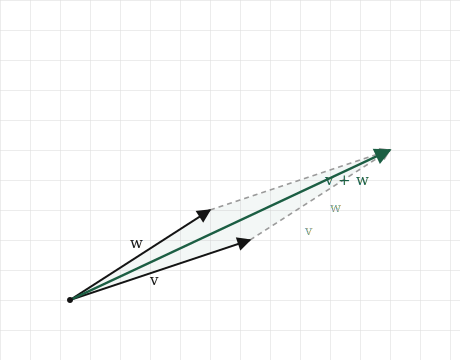
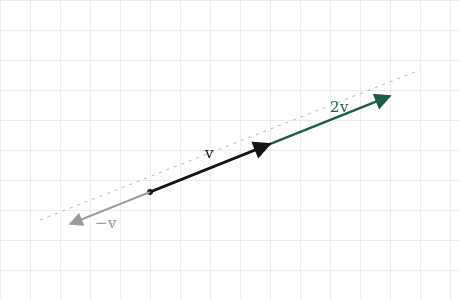
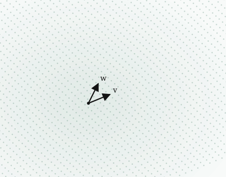
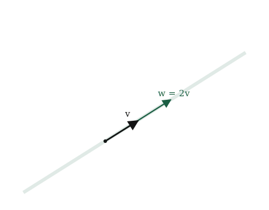

# Adding, Scaling, and Span

## The itch {.unnumbered}

By the end of the last chapter a song was a vector, a fixed arrow sitting at one spot in space, and we could measure how long that arrow was. That is enough to talk about one song at a time. It is not yet enough to talk about the things we actually care about, which are almost never single songs.

Think about what a playlist really is. Not a list of songs, but a kind of region: a mood, a texture, a stretch of the space where the songs we like tend to fall. A genre is the same, only larger. When we say two playlists "overlap," or that one song sits "between" two others, or that some track is "what you'd get if you crossed these two artists," we are talking about space in a way that a single fixed arrow cannot reach.

So the question for this chapter is about what we can do with vectors once we have more than one. Given a handful of songs, what other songs can we describe using only them? Can we build a point that sits halfway between two tracks? Can we take a direction we like and follow it further than any single song goes? Can we start with two or three vectors and map out the whole region they open up?

All of that turns out to rest on two operations, and only two. We can add vectors together, and we can scale a vector up or down. Everything in this chapter, up to and including the idea that a few vectors can lay out a whole region of space, is built from just those two moves. They are simple enough to define in a sentence each, and between them they are most of what linear algebra ever does.

## The picture {.unnumbered}

Start with adding, because it is the one we already set up. At the end of the last chapter we said a vector is a journey, not a place: $[3, 4]$ means three across and four up, and it lands where it lands only because we started at the origin. If a vector is a journey, then adding two of them should mean the obvious thing. Do the first journey, and from wherever it leaves us, do the second.

Picture two vectors, $\mathbf{v}$ and $\mathbf{w}$. Walk $\mathbf{v}$ first: from the origin to the tip of $\mathbf{v}$. Now, without going back, walk $\mathbf{w}$ starting from where $\mathbf{v}$ ended. We finish somewhere new, and the arrow from the origin straight to that finishing point is the sum $\mathbf{v} + \mathbf{w}$. Laid out this way, tip of the first to tail of the second, the picture almost draws itself.

It does not matter which journey we take first. Walk $\mathbf{w}$ and then $\mathbf{v}$ and we land at exactly the same place, having traced the other two sides of the same parallelogram. Two vectors and their sum always close up into that shape, which is worth holding onto: adding vectors is not a single path but a parallelogram, and the sum is its far corner.

{#fig-addition width=75%}

Scaling is the second move, and it is simpler. Take one vector and stretch it. If $\mathbf{v}$ is a journey, then $2\mathbf{v}$ is the same journey walked twice as far in the same direction, and $\tfrac{1}{2}\mathbf{v}$ is half of it. The arrow keeps pointing exactly where it did; only its length changes. Scaling never turns a vector, it only lengthens or shortens it.

One case is worth seeing before it surprises us. Scaling by a negative number, say $-1$, does not break the rule so much as extend it. The arrow keeps to the same line it was always on, but now it points backwards along that line, to the far side of the origin. Negative scaling is still "the same direction" in the sense that matters here: the same line through space, walked the other way.

{#fig-scaling width=70%}

Now put the two moves together, because that is where the chapter is really going. Take two vectors, scale each one by however much we like, and add the results. Something like $2\mathbf{v} + 3\mathbf{w}$, or $\tfrac{1}{2}\mathbf{v} - \mathbf{w}$. A recipe of that shape, some amount of one vector plus some amount of another, is called a **linear combination**, and it is the single most important construction in this part of the book. Almost everything ahead is linear combinations wearing different clothes.

Once we can build linear combinations, one last question opens up on its own. If we are allowed every possible combination of $\mathbf{v}$ and $\mathbf{w}$, every amount of each, positive or negative, whole or fractional, what is the full set of places we can reach? That set has a name, the **span** of the two vectors, and picturing it is where we are headed next.

## The math, built up {.unnumbered}

We have two moves, adding and scaling, and so far we only have them as pictures. To hand them to a machine we need them as arithmetic. Both turn out to be about as simple as arithmetic gets.

Take addition first. We have $\mathbf{v} = [v_1, v_2]$ and $\mathbf{w} = [w_1, w_2]$, and we want the single arrow that is $\mathbf{v}$ followed by $\mathbf{w}$. Walking $\mathbf{v}$ moves us $v_1$ across and $v_2$ up. Walking $\mathbf{w}$ from there moves us a further $w_1$ across and $w_2$ up. So in total we have moved $v_1 + w_1$ across and $v_2 + w_2$ up, and that total is the sum:

$$
\mathbf{v} + \mathbf{w} = [v_1 + w_1, \; v_2 + w_2]
$$

That is the whole rule. Add vectors by adding the numbers that sit in the same slot: first with first, second with second. The tip-to-tail picture and this line of arithmetic are the same fact. One is what we see, the other is what we compute.

Scaling is even shorter. To walk $\mathbf{v}$ twice as far we double each step, and to walk it by any amount $c$ we multiply each step by $c$:

$$
c\,\mathbf{v} = [c\,v_1, \; c\,v_2]
$$

Multiply every number in the list by the same amount. That is scaling, in full. Notice the negative case falls out for free: $c = -1$ multiplies each number by $-1$, flipping the arrow to the far side of the origin exactly as the picture promised, with no new rule required.

Both operations extend to longer lists without a single change to the idea. A vector with three hundred numbers is added slot by slot, three hundred additions, and scaled by multiplying all three hundred numbers at once. Same rule, longer list, which is the pattern the whole book runs on.

Now we can write down the construction the chapter has been circling. Scale some vectors, add the results, and the recipe

$$
c_1 \mathbf{v}_1 + c_2 \mathbf{v}_2 + \cdots + c_k \mathbf{v}_k
$$

is a **linear combination** of the vectors $\mathbf{v}_1$ through $\mathbf{v}_k$. The numbers $c_1$ through $c_k$ are the amounts, one per vector, and they are allowed to be anything: positive, negative, fractional, zero. Every linear combination is just the two moves we already have, applied together and then read off as one arrow.

That last freedom, that the amounts can be *anything*, is what opens up a whole region rather than a few scattered points. Fix two vectors $\mathbf{v}$ and $\mathbf{w}$ and let their amounts range over every possible pair of numbers. The set of all the arrows we can build this way is called the **span** of $\mathbf{v}$ and $\mathbf{w}$.

For two vectors that point in different directions, the span is the entire flat plane. Every point on the page is reachable, because any spot can be arrived at by walking some amount of $\mathbf{v}$ and some amount of $\mathbf{w}$. Dial the two amounts and we can steer anywhere.

{#fig-span width=70%}

## Build it yourself {.unnumbered}

Both operations were simple enough on paper. In NumPy they are simpler still, because the componentwise rule is exactly how NumPy already thinks.

Start with two vectors and add them:

```{python}
import numpy as np

v = np.array([2.0, 1.0])
w = np.array([1.0, 3.0])

print(v + w)
```

The result is `[3.0, 4.0]`, which is $[2+1, \; 1+3]$, first slot with first, second with second. We did not loop over the numbers or add them one at a time. We wrote `v + w` and NumPy added each slot to its partner on its own. That is the componentwise rule from the last section, and it is built into the `+` sign.

Scaling is the same story. Multiply a vector by a number and every slot is multiplied at once:

```{python}
print(2 * v)
print(0.5 * v)
print(-1 * v)
```

Three scalings, no loops. `2 * v` doubles both numbers, `0.5 * v` halves them, and `-1 * v` flips their signs, which is the arrow pointing back through the origin exactly as we drew it.

Now put both moves together into a linear combination. Here is $2\mathbf{v} + 3\mathbf{w}$:

```{python}
print(2 * v + 3 * w)
```

That single line scaled two vectors and added the results, and NumPy read it the way we read it on paper: scale, scale, add. Every linear combination we will ever write, however many vectors and whatever the amounts, is this same line made longer.

It is worth checking once that NumPy's `+` really is doing the slot-by-slot rule and nothing else. We can spell the addition out by hand, building the result one slot at a time, and compare:

```{python}
by_hand = np.array([v[0] + w[0], v[1] + w[1]])

print(by_hand)
print(v + w)
print(np.array_equal(by_hand, v + w))
```

The hand-built version and `v + w` are the same, and `np.array_equal` confirms it. There is no hidden cleverness in the `+`. It is the rule we derived, applied to each slot.

One last thing, the same one that mattered for length. None of this cared that our vectors had two numbers. Give them three hundred and every line above works unchanged: `v + w` adds three hundred slots, `2 * v` scales three hundred numbers, and a linear combination stirs them together without a single edit. The picture ran out at three numbers. The arithmetic, and the code, did not.

## Where it lives in ML {.unnumbered}

Adding and scaling look almost too simple to be the point. They are the point. Nearly everything a neural network does, from the first layer to the last, is linear combinations, the exact move we just built.

Picture a single artificial neuron, the basic unit of a network. It receives some numbers, the outputs of the neurons before it, as a vector. It holds its own vector of the same length, called its **weights**. To produce its answer it multiplies each incoming number by the matching weight and adds the results, then does one small extra step we will meet later. That multiply-each-and-add is a linear combination, with the weights as the amounts. A neuron is a linear combination with an opinion about which inputs matter, and that opinion is what the weights are.

A layer is many neurons at once, so a layer is many linear combinations of the same inputs, each with its own weights. A network is layers stacked on layers. Almost the whole structure, the part that gets trained, the part that holds what the model has learned, is linear combinations repeated at scale. When we say a model has seven billion parameters, we are mostly counting the amounts in a very large number of linear combinations.

Because the operations are this simple, something surprising becomes possible: we can do arithmetic on meaning. Recall that a word is a vector, a few hundred learned numbers. It turns out those vectors can be added and subtracted and the results still land on sensible words. The celebrated example is

$$
\text{king} - \text{man} + \text{woman} \approx \text{queen}
$$

Read as vectors, this is only adding and scaling. Start at the vector for *king*, subtract the vector for *man*, which is scaling by $-1$ and adding, then add the vector for *woman*. The arrow that results lands nearest, of all the word vectors, to the one for *queen*. The direction from *man* to *woman* turns out to be roughly the same direction as from *king* to *queen*, so walking it moves us the way we would hope. Nobody built that in. It fell out of numbers a model chose on its own, and we reach it with nothing but the two moves from this chapter.

Now the failure worth knowing, and it is a quiet one again. Because a linear combination is only scaling and adding, everything a single layer can do stays within reach of those two moves, and that is a real limit. Scaling and adding can stretch space, flip it, and slide it around, but they cannot bend it. Stack a hundred layers that each only add and scale, and the whole stack still only adds and scales, no matter how tall it is. A network built purely from linear combinations, however many layers deep, can only draw straight lines. It could never tell two tangled-together classes apart, because no amount of stretching and sliding will separate them. And this straightness, lines staying lines and space never bending, is what the word *linear* has been pointing at all along. It is why the subject is called linear algebra.

This is why the "one small extra step" each neuron takes is not a detail. That step, a simple bending applied after the linear combination, is the whole reason stacking layers buys us anything. Without it, depth is an illusion and the network collapses back to a single linear combination. We will build that bend, and see exactly why it rescues us, when we reach neural networks in Part 4. For now the thing to hold onto is that the linear combination is the engine, and it is this chapter's two operations, running at enormous scale.

## Common misunderstandings {.unnumbered}

**Span is not always the whole space.** We ended the span section with two vectors filling the entire plane, which is the usual case but not the only one. Suppose the two vectors point along the same line, say $\mathbf{v} = [1, 1]$ and $\mathbf{w} = [2, 2]$. The second is just the first scaled by two, so it opens up no new direction. Every combination of them, whatever amounts we choose, lands somewhere on that one line through the origin. The span has collapsed from a plane to a line. Two vectors reach a plane only when they genuinely point different ways; if one is a scaled copy of the other, they are really one direction wearing two coats, and one direction spans only a line.

{#fig-collinear width=70%}

This is not a curiosity. It is the whole reason the next chapters care about words like independence and rank. The question "do these vectors actually point in different directions, or are some of them redundant" turns out to decide how much space a set of vectors can reach, and we will make it precise before long.

**Scaling by a negative number is not the same as subtracting.** It is tempting to read $-2\mathbf{v}$ as "take away two of $\mathbf{v}$," as if we were removing something. Nothing is removed. Scaling by $-2$ builds a brand new arrow, twice as long as $\mathbf{v}$ and pointing the opposite way, and it exists in its own right. Subtraction only enters when we then add that arrow to another. Keep scaling and subtracting separate: scaling reshapes one arrow, subtracting is really adding a negatively scaled one.

**Adding vectors does not average them.** When we add $\mathbf{v}$ and $\mathbf{w}$ we land at the far corner of the parallelogram, which is further out than either vector alone. That is not the point "between" them. The midpoint is a different construction, $\tfrac{1}{2}\mathbf{v} + \tfrac{1}{2}\mathbf{w}$, a particular linear combination with both amounts set to a half. Plain addition and averaging feel similar because both mix two vectors, but they land in different places, and confusing them will put a point where you did not mean to put one.

**A longer vector is not a more important one.** After the last chapter it is easy to read length as weight, as though the longest vector in a combination should dominate. Length and role are separate. A short vector scaled by a large amount contributes more than a long vector scaled by almost nothing. What a vector brings to a combination is set by its amount, its $c$, not by how long the arrow happened to be to begin with. This is the same scales problem from the last chapter looked at from the other side: raw length is not the same as influence.

## Check your intuition {.unnumbered}

As before, try each one before opening the answers. None of these asks you to recall a rule. Each asks you to use the two moves.

**1.** We have $\mathbf{v} = [2, 1]$ and $\mathbf{w} = [1, 2]$. What is $\mathbf{v} + \mathbf{w}$, and what is $\mathbf{v} - \mathbf{w}$? Draw both if it helps.

**2.** Take a single vector $\mathbf{v} = [3, 1]$. Describe, in words, the full set of points you can reach using only scalings of $\mathbf{v}$, every possible amount. What shape is it?

**3.** We have two vectors $\mathbf{v} = [1, 0]$ and $\mathbf{w} = [2, 0]$. Between them, can we reach the point $[0, 1]$? Why or why not?

**4.** Find the amounts $a$ and $b$ that make $a\,[1, 0] + b\,[0, 1]$ equal to $[5, 3]$. Now do the same for any target $[x, y]$.

**5.** Is the midpoint between $\mathbf{v}$ and $\mathbf{w}$ a linear combination of them? If so, what are the two amounts?

::: {.callout-tip collapse="true"}
## Answers

**1.** Adding slot by slot, $\mathbf{v} + \mathbf{w} = [2+1, \; 1+2] = [3, 3]$. Subtracting, $\mathbf{v} - \mathbf{w} = [2-1, \; 1-2] = [1, -1]$. Notice the sum leans up and to the right, halfway in feel between the two originals in direction though longer than either, while the difference points down and to the right, off toward where $\mathbf{v}$ sits relative to $\mathbf{w}$. Subtraction is just adding $-\mathbf{w}$, and $-\mathbf{w} = [-1, -2]$ points the opposite way to $\mathbf{w}$, which is why the result swings below the axis.

**2.** Every scaling of $\mathbf{v} = [3, 1]$ is some amount $c$ times it, $[3c, \; c]$. As $c$ runs through all values, positive, negative, and zero, these points trace the entire straight line through the origin that passes along $\mathbf{v}$'s direction. The shape is a line: one vector spans a line, exactly the collapsed case from the misunderstandings. Positive $c$ gives the half heading out along $\mathbf{v}$, negative $c$ the half heading back through the origin, and $c = 0$ the origin itself.

**3.** No. Both $\mathbf{v} = [1, 0]$ and $\mathbf{w} = [2, 0]$ have a second number of zero, and $\mathbf{w}$ is simply $2\mathbf{v}$, so any combination $a\mathbf{v} + b\mathbf{w}$ has the form $[\,a + 2b, \; 0\,]$. The second slot is always zero, no matter what $a$ and $b$ we pick. The point $[0, 1]$ has a second slot of one, so it can never be reached. These two vectors point the same way and span only the horizontal line, and $[0, 1]$ is off that line.

**4.** Here $a\,[1, 0] + b\,[0, 1] = [a, b]$, so to hit $[5, 3]$ we need $a = 5$ and $b = 3$. For a general target $[x, y]$ the same reading gives $a = x$ and $b = y$ directly. These two vectors are special: the amounts you need are just the target's own numbers. That is not a coincidence, and it is the first glimpse of why $[1,0]$ and $[0,1]$ are the natural reference vectors for the plane, a thread we pick up when we reach basis.

**5.** Yes. The midpoint is $\tfrac{1}{2}\mathbf{v} + \tfrac{1}{2}\mathbf{w}$, a linear combination with both amounts equal to a half. It sits squarely between the two arrow tips, which is exactly what averaging two things should give, and it is a different point from $\mathbf{v} + \mathbf{w}$, the far corner of the parallelogram. Halving both amounts pulls the sum back to the middle.
:::