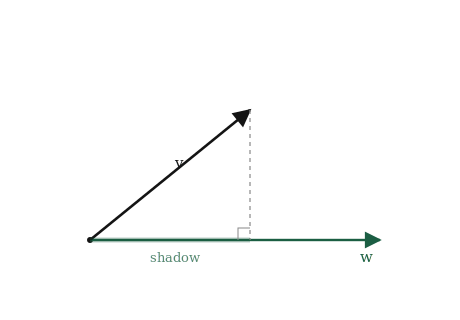
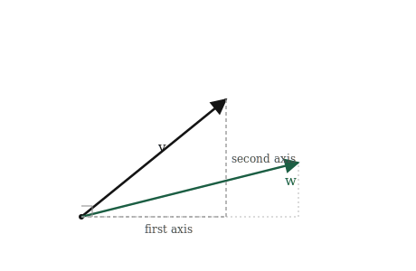
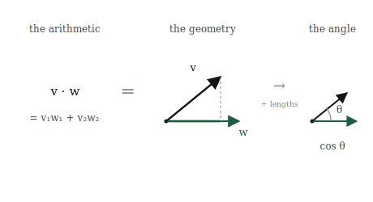
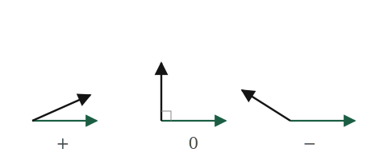

# The Dot Product

## The itch {.unnumbered}

Two chapters ago we asked how a machine could tell that two songs are similar, and we have been carrying that question ever since. We turned each song into a vector, an arrow in space. We learned to measure how long one arrow is. We learned to add two arrows and to scale them. But we never answered the actual question. Length tells us about one arrow on its own. Adding and scaling let us build new arrows. None of it tells us how *alike* two arrows are.

Look at what "alike" should mean, now that songs are arrows. Two similar songs became two arrows pointing much the same way. Two songs with nothing in common became two arrows pointing off in different directions. So similarity is about the *angle* between two arrows. Small angle, alike. Wide angle, different. Pointing opposite ways, as unalike as it gets.

That reframes the whole problem into something almost embarrassingly concrete. We do not need to understand music. We need to measure the angle between two arrows, using nothing but the lists of numbers the machine actually holds. If we can turn two lists of numbers into a single number that says "these point the same way" or "these point apart," we are done. The recommendation, the face unlock, the search result, all of it comes down to that one number.

There is a single operation that produces it. It is the most useful tool in this part of the book, the one the first chapter promised and the last one kept pointing at. It takes two vectors and returns one number, and packed inside that number are the angle between them, the shadow one casts on the other, and the similarity we have been chasing since the first page. It is called the dot product, and everything in this chapter is that one operation seen from three sides.

## The picture {.unnumbered}

We want the angle between two arrows, but angle is an awkward thing to measure directly from two lists of numbers. So we come at it sideways, through a picture that turns out to carry the angle inside it: the shadow one arrow casts on another.

Take two vectors, $\mathbf{v}$ and $\mathbf{w}$, drawn from the same origin. Now imagine light coming straight down onto $\mathbf{w}$, at right angles to it, and look at the shadow $\mathbf{v}$ casts along the line of $\mathbf{w}$. That shadow has a length, and it is this shadow that quietly knows the angle.

Watch what the shadow does as we swing $\mathbf{v}$ around. When $\mathbf{v}$ points the same way as $\mathbf{w}$, it lies flat along $\mathbf{w}$ and its shadow is as long as $\mathbf{v}$ itself. Nothing is lost, because nothing is off to the side. As $\mathbf{v}$ tilts away, the shadow shortens. When $\mathbf{v}$ stands at a right angle to $\mathbf{w}$, straight up from it, it casts no shadow along $\mathbf{w}$ at all. The shadow has shrunk to nothing. Tilt $\mathbf{v}$ further, past the right angle, and it begins to cast a shadow the other way, pointing backwards along $\mathbf{w}$, which we read as a negative length.

{#fig-projection width=75%}

So the shadow's length is a quiet report on the angle. Full-length shadow means the arrows are aligned. Shrinking shadow means the angle is opening. Zero shadow means a right angle, arrows completely unrelated in direction. Negative shadow means they lean opposite ways. We have turned "what is the angle" into "how long is the shadow," and length is something we already know how to compute from lists of numbers.

There is one wrinkle to be honest about now, because it shapes the formula ahead. The shadow depends on two things at once, not one. It depends on the angle, which is what we are chasing, but also on how long $\mathbf{v}$ is to begin with, since a longer arrow casts a longer shadow at the same angle. And when we build the actual operation, it will fold in the length of $\mathbf{w}$ too. The dot product does not hand us the angle cleanly on its own. It hands us the angle tangled together with both lengths, and part of the work in this chapter is learning to separate them back out when we want the angle alone.

## The math, built up: the formula {.unnumbered}

We have a shadow that knows the angle, and we need it as arithmetic on two lists. Rather than reach for a formula, let us build it from the simplest possible case and let the general rule assemble itself.

Start with the two reference vectors from the last chapter, $[1, 0]$ and $[0, 1]$, pointing straight along the axes. Ask for the shadow of $[1, 0]$ on $[0, 1]$. One points along the ground, the other straight up, at a perfect right angle, so from the picture the shadow is zero. Now the shadow of $[1, 0]$ on itself: the arrow lies flat along its own direction, so the shadow is its full length, one.

Those two facts are the whole engine:

- along the same axis, the shadow is full,
- across a right angle, the shadow is nothing.

Now take two general vectors, $\mathbf{v} = [v_1, v_2]$ and $\mathbf{w} = [w_1, w_2]$, and split each into its along-the-axes pieces. The $v_1$ part of $\mathbf{v}$ points purely along the first axis, the $v_2$ part purely along the second, and the same for $\mathbf{w}$. To ask how much of $\mathbf{v}$ falls along $\mathbf{w}$, we add up the contributions piece by piece, and by the two facts above, only the matching pieces survive.

{#fig-cross-terms width=75%}

First axis meets first axis, and those align, so they contribute $v_1 w_1$. Second meets second, contributing $v_2 w_2$. First axis meets second axis sits at a right angle and contributes nothing. The crossing terms vanish, and what remains is a sum of matching products:

$$
\mathbf{v} \cdot \mathbf{w} = v_1 w_1 + v_2 w_2
$$

That is the **dot product**. Multiply the numbers in matching slots and add the results. The little dot is the whole notation. It takes two vectors and returns a single number, and that number is the shadow relationship from the picture, now written purely in the lists the machine holds.

It is the same slot-by-slot pattern as length and addition, and like them it does not care how long the lists are. Three hundred numbers means three hundred products summed into one:

$$
\mathbf{v} \cdot \mathbf{w} = v_1 w_1 + v_2 w_2 + \cdots + v_n w_n
$$

## What the dot product contains {.unnumbered}

Before we open it up, one thing needs saying plainly, because it is the weld holding this whole chapter together. We built the dot product two ways and have not yet admitted they are the same thing. One way was a picture: the shadow one arrow casts on another. The other was arithmetic: multiply matching slots and add. These are not two facts about the dot product. They are one number reached by two roads.

The number you get from multiplying and adding is exactly the length of $\mathbf{w}$ times the length of $\mathbf{v}$'s shadow on $\mathbf{w}$. That equality is the bridge. On one side sits arithmetic the machine can run on two lists. On the other sits geometry we can see. The dot product is the single thing standing on both sides at once, which is why one small sum of products can tell us about shadows, lengths, and angles all together.

{#fig-three-views width=90%}

Read the three faces below as three consequences of that one bridge, not three separate discoveries.

**It contains length.** Take the dot product of a vector with *itself*. Every slot multiplies by itself, giving $v_1^2 + v_2^2 + \cdots$, which is exactly what sat under the square root when we measured length. So

$$
\mathbf{v} \cdot \mathbf{v} = \lVert \mathbf{v} \rVert^2.
$$

The dot product of a vector with itself is its length squared. Length was never a separate idea; it was the dot product looking in a mirror.

**It contains the angle.** This is the relation the chapter turns on, tying the arithmetic back to the shadow:

$$
\mathbf{v} \cdot \mathbf{w} = \lVert \mathbf{v} \rVert \, \lVert \mathbf{w} \rVert \cos\theta,
$$

where $\theta$ is the angle between the arrows. It says exactly what the picture warned it would: the dot product is the angle, through $\cos\theta$, tangled together with both lengths. Not the angle alone, but the angle wearing the two lengths as coats. We will not derive this from scratch here; it is the law of cosines in vector dress, and the derivation waits in the appendix for anyone who wants it. What matters is reading it.

{#fig-sign width=90%}

When the arrows align, $\theta$ is zero, $\cos\theta$ is one, and the dot product is just the two lengths multiplied, as large as it can be. At a right angle, $\cos\theta$ is zero and the whole thing collapses to zero, however long the arrows are. Pointing opposite ways, $\cos\theta$ is $-1$ and the dot product is as negative as it gets. The sign carries the headline: positive means the arrows lean together, zero means perpendicular, negative means they lean apart.

**It contains a test for right angles.** That middle case is the one we will lean on hardest, so it gets its own line. Two vectors are perpendicular exactly when their dot product is zero:

$$
\mathbf{v} \cdot \mathbf{w} = 0 \quad \Longleftrightarrow \quad \mathbf{v} \text{ and } \mathbf{w} \text{ are perpendicular.}
$$

No angle measured, no trigonometry. Multiply the slots, add them, and if the answer is zero the arrows stand at a right angle. It is the cleanest test in linear algebra, and it falls out of a sum of products for free.

## Build it yourself {.unnumbered}

The dot product is a sum of matching products, and that is exactly as short in NumPy as it sounds.

Start with two vectors and form it by hand, the way the formula reads: multiply matching slots, then add:

```{python}
import numpy as np

v = np.array([2.0, 1.0])
w = np.array([1.0, 3.0])

products = v * w
print(products)
print(np.sum(products))
```

`v * w` multiplies slot by slot, giving `[2.0, 3.0]`, and summing those gives `5.0`. That is $2\cdot1 + 1\cdot3$, the dot product spelled out in two steps. NumPy also has it as one built-in:

```{python}
print(np.dot(v, w))
```

Same `5.0`. `np.dot` multiplies the matching slots and adds them, nothing more, exactly what we did above.

Now let us confirm the three faces from the last section, in code, one at a time.

**Length.** The dot product of a vector with itself should be its length squared:

```{python}
print(np.dot(v, v))
print(np.linalg.norm(v) ** 2)
```

Both give `5.0`. The self-dot and the squared length are the same number, as promised.

**The right-angle test.** Two perpendicular vectors should give a dot product of zero. Take $[1, 0]$ and $[0, 1]$, which point straight along the two axes:

```{python}
a = np.array([1.0, 0.0])
b = np.array([0.0, 1.0])
print(np.dot(a, b))
```

Zero, with no angle measured and no trigonometry. The sum of products came out to zero on its own, and that is the whole test.

**The angle.** We can run the tangled relation backwards to pull the actual angle out. Since $\mathbf{v} \cdot \mathbf{w} = \lVert \mathbf{v} \rVert \lVert \mathbf{w} \rVert \cos\theta$, we divide the dot product by the two lengths to get $\cos\theta$, then undo the cosine:

```{python}
cos_theta = np.dot(v, w) / (np.linalg.norm(v) * np.linalg.norm(w))
theta = np.arccos(cos_theta)

print(cos_theta)
print(np.degrees(theta))
```

The angle between $\mathbf{v}$ and $\mathbf{w}$ comes out to about 45 degrees. Notice what we did: dividing by the two lengths stripped the coats off, leaving $\cos\theta$ alone, and `arccos` turned that back into an angle. Separating the angle from the lengths, which sounded abstract in the last section, is three lines of arithmetic.

And, as ever, none of this depended on the vectors being short. What is worth noticing here is not just that the dot product survives three hundred numbers, but that all three faces survive together. `np.dot` still sums the products, the self-dot is still the length squared, the zero test still finds a right angle, and the angle still separates out, all from the same one line, all in a space no one can picture. One operation carried the whole toolkit up there at once.

## Where it lives in ML {.unnumbered}

We can finally answer the question we opened the book with. How does a machine know two songs are similar? It takes their two vectors and computes one dot product, then divides out the two lengths. What is left is $\cos\theta$, a single number between $-1$ and $1$ that says how nearly the two arrows point the same way. Close to $1$, nearly aligned, nearly the same song. Close to $0$, unrelated. Below zero, opposite. That number has a name, **cosine similarity**, and it is the dot product with the lengths stripped off, exactly the move we made three lines into the last section.

$$
\text{cosine similarity} = \frac{\mathbf{v} \cdot \mathbf{w}}{\lVert \mathbf{v} \rVert \, \lVert \mathbf{w} \rVert} = \cos\theta
$$

Dividing the lengths out is not a technicality. It is the whole reason cosine similarity is used instead of the raw dot product. Remember the loud-song problem from the first chapter: a track that is loud on every measure has a long vector, and a raw dot product rewards it for being long, not for being similar. Stripping the lengths cancels that. Two songs count as similar when they point the same way, whatever their volumes, which is what we wanted "similar" to mean all along. The angle is the honest measure; the length was never the point.

This one operation, dot product then normalise, is not a music trick. It is how similarity is measured almost everywhere in machine learning.

Search runs on it. Your query becomes a vector, every document becomes a vector, and the engine returns the documents whose vectors point most nearly the same way as your query's. "Relevant" means small angle.

Recommendation runs on it. Your taste is a vector, every item is a vector, and what gets recommended is whatever points your way. The whole idea of "people like you liked this" is a search for small angles in a space of vectors.

Retrieval in modern language systems runs on it. When a model needs to find the passage most relevant to a question, it embeds both as vectors and ranks by cosine similarity. The reason a chatbot can pull the right paragraph out of a thousand-page manual is a great many dot products, each one a sum of matching products.

And then there is attention, the operation at the heart of the models behind the current wave of AI. A model reading a sentence needs to decide, for each word, which other words matter to it. It does this by giving every word two vectors, a query and a key, and taking the dot product of one word's query with every other word's key. A large dot product means "this word is relevant to that one, attend to it." That is the entire mechanism in one line: relevance is a dot product, and the model steers its attention by where those products come out large. The operation you just built from a shadow on the floor is, run billions of times, most of what a transformer does when it reads.

Now the failure, and in this chapter it is loud rather than quiet, because it is the one that breaks recommendation systems in practice. The dot product only means "similarity" when the slots line up. If document vectors and query vectors were built by different recipes, so that slot 7 means one thing in one and something else in the other, the dot product still returns a number, confidently, and the number is noise. Everything in this chapter assumed both vectors live in the same space with the same meaning in every slot. Break that assumption and the arithmetic keeps working while the meaning quietly drains out, which is the hardest kind of bug to see: the one that never raises an error.

## Common misunderstandings {.unnumbered}

The dot product is simple to compute and easy to misread. These are the misreadings worth heading off.

**The dot product is not vector multiplication.** It is tempting to see $\mathbf{v} \cdot \mathbf{w}$ as "multiplying two vectors," the way we multiply two numbers. It is not, and the giveaway is the output. Multiply two numbers and you get a number. Multiply two vectors slot by slot, with `v * w`, and you get a *vector*, the list of matching products. The dot product takes that vector and adds its entries, collapsing it to a single number. So the dot product is not multiplication; it is multiplication *followed by adding up*, and that final sum is what changes its character entirely. Watch for this in code especially: `v * w` and `np.dot(v, w)` are different operations, one returning a vector and one a number, and reaching for the wrong one is a common bug.

**A dot product of zero does not mean "unrelated" in meaning.** We built the clean fact that a zero dot product means the arrows are perpendicular. It is easy to slide from "perpendicular" to "nothing to do with each other," but those are not the same claim. Perpendicular is a statement about direction in the vector space, nothing more. Two word vectors might come out perpendicular, dot product zero, and still be deeply related in meaning in ways the particular vectors simply do not capture. The dot product reports on the geometry we built, faithfully. Whether that geometry captures the meaning we care about is a separate question, and a much harder one.

**Stripping the lengths is not always what you want.** Cosine similarity divides out both lengths to get the pure angle, and for comparing songs or documents that is right, because length was contaminating the answer. But the length is not always noise. Sometimes how *much* of something there is genuinely matters, and throwing the lengths away throws real information away with them. Cosine similarity is the right tool when direction is what carries meaning and size does not. Deciding which of those you are in is a judgement about your data, not something the formula makes for you.

**`arccos` can hand you a `nan`.** When you recover an angle by dividing the dot product by the two lengths and calling `arccos`, the arithmetic can bite. In exact maths, $\cos\theta$ for two vectors always lands between $-1$ and $1$. In floating point it can drift a hair outside that range from rounding alone, and the drift goes either way. Take a vector, scale it to length one, and dot it with itself. The true answer is exactly one, a vector makes a zero angle with itself, but the machine does not always land exactly there:

```{python}
import numpy as np

u = np.array([1.0, 1.0, 1.0])
u = u / np.linalg.norm(u)          # scale to length 1

cos_theta = np.dot(u, u)
print(cos_theta)                    # 1.0000000000000002, just over the limit
```

That last digit is the whole problem. Feed a value above one to `arccos`, which is undefined there, and it does not raise an error. It returns `nan`, the quiet not-a-number that then poisons everything downstream:

```{python}
print(np.arccos(cos_theta))         # nan
```

This is the same approximate-arithmetic issue from the first chapter, surfacing in a new place. The standard guard is to clip the value back into range before taking the inverse cosine:

```{python}
theta = np.arccos(np.clip(cos_theta, -1.0, 1.0))
print(np.degrees(theta))
```

Clipping forces the value back to exactly one before `arccos` sees it, and the angle comes out as zero, which is correct. Reach for `np.clip` any time you feed a computed cosine into `arccos`.

## Check your intuition {.unnumbered}

Try each before opening the answers. As always, these ask you to use the dot product, not recite it.

**1.** Compute $\mathbf{v} \cdot \mathbf{w}$ for $\mathbf{v} = [3, 0]$ and $\mathbf{w} = [0, 5]$. What does the answer tell you about the angle between them, without computing the angle?

**2.** Two vectors have a positive dot product. Then we replace $\mathbf{w}$ with $-\mathbf{w}$. What is the sign of the new dot product, and what has happened to the angle?

**3.** We have $\mathbf{v} = [1, 1]$ and $\mathbf{w} = [3, 3]$. Compute the dot product, and compute the cosine similarity. Why is one of these large and the other exactly $1$?

**4.** Without computing anything, which pair is more similar in direction: two vectors with a dot product of $50$, or two vectors with a dot product of $10$?

**5.** A vector's dot product with itself is $0$. What can you say about the vector?

::: {.callout-tip collapse="true"}
## Answers

**1.** The dot product is $3\cdot0 + 0\cdot5 = 0$. A zero dot product means the two arrows are perpendicular, so they sit at a right angle, without our measuring any angle to find out. This matches the picture: $[3, 0]$ points along the first axis and $[0, 5]$ straight up the second, and the axes meet at a right angle.

**2.** Flipping $\mathbf{w}$ to $-\mathbf{w}$ negates every slot, so every product in the sum flips sign, and the dot product flips from positive to negative. Geometrically, reversing $\mathbf{w}$ swings it to point the opposite way, which opens the angle past a right angle: two arrows that leaned together now lean apart. Positive to negative is exactly the crossing from acute to obtuse.

**3.** The dot product is $1\cdot3 + 1\cdot3 = 6$. The cosine similarity divides that by the two lengths: $\lVert\mathbf{v}\rVert = \sqrt{2}$ and $\lVert\mathbf{w}\rVert = \sqrt{18}$, so the similarity is $6 / (\sqrt{2}\cdot\sqrt{18}) = 6/6 = 1$. The dot product is large partly because $\mathbf{w}$ is long, three times the length of $\mathbf{v}$. Cosine similarity strips that length away and reports pure direction, and since $\mathbf{w}$ is just $\mathbf{v}$ scaled up, the two point in exactly the same direction: similarity $1$. This is the loud-song problem in miniature. The raw dot product is inflated by length; the cosine sees only direction.

**4.** You cannot tell. The raw dot product mixes direction together with both lengths, so a dot product of $50$ might come from two barely-aligned but very long vectors, while a $10$ might come from two short vectors pointing almost exactly the same way. Without dividing out the lengths, the raw number does not rank similarity. This is precisely why cosine similarity exists, and why the question has no answer as asked.

**5.** The dot product of a vector with itself is its length squared, so if that is zero, the vector has length zero. The only vector with length zero is the zero vector, all slots zero. It is the same exception we met when normalising: the one vector that is its own perpendicular, because it has no direction at all.
:::