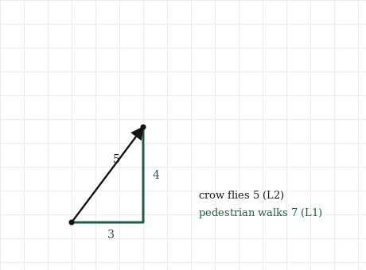
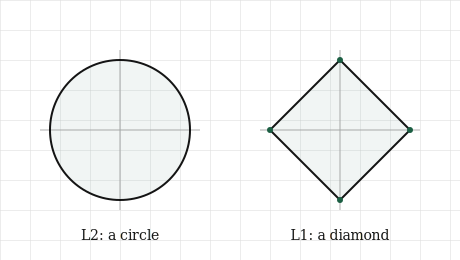

# Length, Distance, and Norms

## The itch {.unnumbered}

Back at the start we measured the length of an arrow with Pythagoras, squared the numbers, summed them, took the root, and called it the length. It was the length, and nothing in this chapter takes that back. But there was a quiet assumption hiding inside it, one we never said out loud, and it is worth dragging into the light now because it turns out we had a choice we did not know we were making.

Here is the assumption. When we measured the distance from the origin to the tip of the arrow, we measured it as the crow flies: a single straight line, cutting diagonally across, ignoring everything in the way. That is one honest way to measure distance. It is not the only one.

Think about actually getting somewhere in a city laid out in blocks. You cannot cut diagonally through the buildings. You walk so far along one street, then turn and walk so far along another, and the distance you actually travel is the sum of those two walks, not the diagonal a bird would fly. Same two points, same start and finish, and a completely different, equally real number for how far apart they are. The bird and the pedestrian disagree, and neither is wrong. They are answering different questions.

So "how far apart are these two vectors" does not have one answer. It has several, depending on what kind of travel we have in mind, and each kind gives a different notion of length. The straight-line length from the first chapter is one member of a family. This chapter is about the family, what the other members measure, and the one question in machine learning where picking the right member changes everything: why one of them quietly forces a model to throw away features it does not need.

## The picture {.unnumbered}

Put two points on a grid: the origin, and a point three streets across and four streets up. We already know what the straight-line distance is, because we computed exactly this in the first chapter. Pythagoras gives $\sqrt{3^2 + 4^2} = 5$. The bird flies five.

Now walk it as a pedestrian. Three blocks across, four blocks up, and it does not matter which order or how we zigzag, every legal path that only moves along streets covers the same total: $3 + 4 = 7$. The pedestrian walks seven. Two honest distances for the same two points, five and seven, and the only difference is whether we are allowed to cut the corner.

{#fig-two-paths width=75%}

These two ways of measuring have plain names. The straight-line distance, the one from chapter one, is the **L2 norm**. The city-block distance, the sum of how far we move along each axis, is the **L1 norm**. The names will make more sense once we see the arithmetic, but the pictures are the thing to hold: L2 cuts across, L1 keeps to the grid.

There is a second way to see the difference, and it is the one that matters most later, so it is worth setting up carefully now. Ask a simple question of each norm: what does "distance exactly one from the origin" look like? Collect every point that sits at distance one, and see what shape they trace.

For the L2 norm, the straight-line one, every point at distance one is exactly a circle. That is what a circle *is*, the set of points a fixed straight-line distance from a centre. No surprise there.

For the L1 norm, the city-block one, the shape is not a circle. The points at city-block distance one from the origin trace a diamond, a square balanced on its corner, with its points sitting out on the axes and its flat sides cutting across the diagonals. It looks strange until you check a corner against a side. The point one step out along an axis, straight out and nowhere else, is city-block distance one. But a point out on the diagonal has to spend its budget of one on *both* axes at once, so it cannot reach as far along either, and the boundary pulls in. Full reach along the axes, pinched on the diagonals: that is a diamond.

{#fig-unit-shapes width=80%}

Hold onto that diamond. The fact that L1's shape has sharp corners sitting exactly on the axes, while L2's is smooth all the way round, looks like a geometric curiosity right now. It is not. When we reach machine learning it will turn out to be the entire reason L1 does something L2 cannot, but we are not ready to say why yet. For now, just notice that the corners are on the axes, and that the circle has no corners at all.

## The math, built up {.unnumbered}

Both norms are easy to write down, and setting them side by side shows exactly what they share and where they part.

Start with the one we already have. The L2 norm squares each number, sums, and takes the root:

$$
\lVert \mathbf{v} \rVert_2 = \sqrt{v_1^2 + v_2^2 + \cdots + v_n^2}
$$

The only new thing is the small $2$ tucked under the bars. In the first chapter we wrote $\lVert \mathbf{v} \rVert$ with no subscript, because there was only one length in the room and it needed no label. Now that there is more than one, the subscript says which. The bare $\lVert \mathbf{v} \rVert$ from here on still means the L2 norm; it is the default, and the subscript is there for when we need to be explicit.

The L1 norm is simpler, and in a way more honest about what it does. No squaring, no root. Take the size of each number, ignoring its sign, and add them up:

$$
\lVert \mathbf{v} \rVert_1 = |v_1| + |v_2| + \cdots + |v_n|
$$

That is the city-block distance in symbols. Each $|v_i|$ is how far we walk along one street, and the norm is the total walk. The absolute value bars are doing the "how far, never mind which way" that a pedestrian cares about: walking three blocks west is three blocks of walking, not minus three.

Look at what the two formulas share. Both take the numbers of the vector, do something to each one that throws the sign away, and add the results. L2 throws the sign away by squaring, which also stretches big numbers out; L1 throws it away with the absolute value, which treats every unit of distance the same. That single difference, squaring versus not, is the whole reason their unit shapes came out so differently, a smooth circle against a cornered diamond.

The naming is not an accident either. There is a whole family here, one norm for each choice of a number $p$: raise each $|v_i|$ to the power $p$, sum, and take the $p$-th root. Set $p = 2$ and the squares and square root give L2. Set $p = 1$ and the powers do nothing, leaving the plain sum of absolute values, L1. Other values of $p$ exist and occasionally matter, but two members of this family carry almost all the weight in machine learning, and they are the two we have. We will not need the general machine again; it is enough to know the two norms are cousins, not strangers, and that the subscript is pointing at which cousin.

One value of $p$ is worth naming just so it does not seem mysterious later. As $p$ grows without bound, the norm comes to care only about the single largest entry, and in the limit it *is* the largest absolute entry, called the L-infinity norm. We will meet it only in passing. The two that earn their keep are L1 and L2.

## Build it yourself {.unnumbered}

Both norms are short in NumPy, and building each by hand first shows there is nothing to either one but the formula.

Take a vector and compute its L2 norm the long way, squaring, summing, rooting, exactly as we did in the first chapter:

```{python}
import numpy as np

v = np.array([3.0, -4.0])

l2_by_hand = np.sqrt(np.sum(v ** 2))
print(l2_by_hand)
```

Five, the crow's distance, and notice it did not care that the second number was negative: squaring removed the sign along the way. Now the L1 norm by hand, taking the size of each number and adding:

```{python}
l1_by_hand = np.sum(np.abs(v))
print(l1_by_hand)
```

Seven, the pedestrian's distance. `np.abs` throws the signs away, three and four, and the sum is seven. Two numbers from the same vector, five and seven, the same pair we drew.

NumPy gives both through one function, `np.linalg.norm`, steered by an argument called `ord` that picks which norm. Left alone it gives L2, the default we have been leaning on:

```{python}
print(np.linalg.norm(v))        # L2, the default
print(np.linalg.norm(v, 2))     # L2, asked for explicitly
print(np.linalg.norm(v, 1))     # L1
```

The first two both print five, the same number, one by default and one by request. The third prints seven. The single argument is the whole difference between the crow and the pedestrian, and it lines up with the subscript from the last section: `ord=1` is $\lVert \mathbf{v} \rVert_1$, `ord=2` is $\lVert \mathbf{v} \rVert_2$.

It is worth confirming, once, that the built-in really is doing our two hand formulas and nothing more:

```{python}
print(np.linalg.norm(v, 2) == l2_by_hand)
print(np.linalg.norm(v, 1) == l1_by_hand)
```

Both `True`. No cleverness hiding in the library: `ord=2` squares-sums-roots, `ord=1` sums absolute values, exactly what we wrote out.

And, as with every operation so far, none of this depends on the vector being short. Give it three hundred numbers and both norms still come back, each on its one line, `ord` still choosing which kind of distance we mean in a space we could never draw.

## Where it lives in ML {.unnumbered}

The two norms do different jobs in machine learning, and the L1 norm does one strange and valuable thing that the diamond has already half-shown us. This is where that shape pays off.

Start with the ordinary job, the one both norms share. A trained model is a big pile of numbers, its weights, and left unchecked those numbers tend to grow large during training, which makes the model brittle: it fits the training data too tightly and stumbles on anything new. A standard fix is to add a penalty for large weights, so the model is pushed to keep them small while it learns. The size of the weights is measured by a norm, and now the choice of norm matters. Penalise with the L2 norm and the model is pushed to make all its weights small. Penalise with the L1 norm and something different happens: the model is pushed to make many of its weights exactly zero. Not small. Zero.

A weight of exactly zero is not a small contribution. It is no contribution. The feature it multiplies has been switched off entirely, dropped from the model as if it were never there. So an L1 penalty does not just shrink the model, it *selects*: it decides which features are worth keeping and sets the rest to nothing. A model with mostly-zero weights is called **sparse**, and sparsity is prized, because a model that uses ten features out of a thousand is one you can inspect, trust, and run cheaply. L1 gives sparsity almost for free. L2 does not. To see why, we go back to the diamond.

Picture the penalty as a budget. The model wants to reach the weights that fit the data best, but the penalty holds it on a leash, keeping it within a fixed distance of the origin. Under L2 that leash traces a circle; under L1, the diamond. The best-fitting weights sit somewhere out beyond the leash, and the model settles at the point on the leash's boundary that gets it as close as possible to that ideal.

Here is the difference, and it is entirely about the shapes. A circle is smooth everywhere, so the closest point on it to some outside target is almost always a generic point, a little of every coordinate, nothing exactly zero. But the diamond is not smooth. It has sharp corners, and those corners stick out further than the flat sides, and, crucially, the corners sit exactly on the axes. A point on an axis is a point where the other coordinates are zero. Because the corners reach out furthest and land on the axes, they are the points the leash most often settles on, and settling on a corner means setting coordinates to zero. The sharp corners of the diamond are sparsity. The smooth circle has no corners to catch on, so it never zeroes anything out.

That is the whole reason the diamond had to be a diamond, and why we were told to hold onto it two sections ago. The geometry we noticed as a curiosity, corners on the axes, is a working feature-selection mechanism. It is the same fact seen twice: once as a shape, once as a model deciding what to ignore.

This shows up all over practical machine learning. It is the heart of a method called the lasso, the standard tool when you have far more features than you can use and need the model itself to tell you which ones matter. It is why L1 penalties appear whenever someone wants a model they can actually read. And the choice between L1 and L2 is exactly the choice from the start of this chapter, crow or pedestrian, made where it has real consequences: the same two ways of measuring distance, now deciding whether a model keeps all its features quietly or throws most of them away.

The failure to watch for is reaching for sparsity when you did not want it, or missing it when you did. Adding an L1 penalty to a model whose features all genuinely matter will zero out useful ones and quietly cost you accuracy. Reaching for L2 when you needed a short, inspectable model will leave you with a thousand tiny non-zero weights and nothing switched off. Neither norm is better. They measure different things, and the diamond and the circle are the picture of the difference.

## Common misunderstandings {.unnumbered}

The two norms are simple, but the ideas around them invite a few wrong turns.

**The L1 norm is not an approximation of the L2 norm.** Because the two often come out close, and both measure something called distance, it is tempting to treat L1 as a rougher, cheaper stand-in for the "real" L2 distance. It is not. Neither is more real. They answer different questions, crow or pedestrian, and for the same vector they generally give different numbers on purpose. When they disagree, that is not error to be corrected; it is the two norms measuring the two different things they were built to measure.

**A bare norm means L2, but only by convention.** We settled that $\lVert \mathbf{v} \rVert$ with no subscript means the L2 norm, and that convention holds throughout this book. But it is a convention, not a law, and other authors sometimes default differently or leave it genuinely ambiguous. When you read a norm in someone else's work with no subscript, the safe move is to check what they mean rather than assume L2. In your own writing, pick a default and hold to it, which is exactly what the subscript is for.

**Sparsity is not the same as smallness.** This is the one that costs people the most. An L2 penalty makes weights small; an L1 penalty makes many of them exactly zero. It is easy to blur these into "both keep the weights under control," but the gap between small and zero is the whole point. A weight of $0.0001$ is still a feature the model is using, still a coordinate that has to be stored, computed, and reasoned about. A weight of $0$ is a feature switched off. Small is quieter. Zero is gone. If you expected an L2 penalty to hand you a short list of features and it gave you a thousand tiny non-zero ones instead, this is why.

**A zero norm does not mean a zero vector for every notion of "size."** For both L1 and L2, a norm of zero does mean the vector is the zero vector, all entries zero, and this is a genuine, useful property. The trap is assuming everything anyone calls a "norm" behaves this way. There is a widely used quantity, confusingly nicknamed the "L0 norm," that simply counts how many entries are non-zero. It is what people often actually mean by sparsity, it is not truly a norm in the strict sense, and it does not follow the rules L1 and L2 do. You do not need it yet. It is flagged only so that the word "norm," met in the wild, is not assumed to always mean what it means here.

## Check your intuition {.unnumbered}

Try each before opening the answers. As always, these ask you to use the two norms, not just recall their formulas.

**1.** For $\mathbf{v} = [3, -4]$, compute both $\lVert \mathbf{v} \rVert_1$ and $\lVert \mathbf{v} \rVert_2$. Which is larger, and will that ordering always hold?

**2.** A vector points straight along one axis, say $\mathbf{v} = [5, 0]$. What are its L1 and L2 norms? Why are they equal here, when they were different for $[3, 4]$?

**3.** Two weight vectors come out of training. One is $[0.5, 0.5, 0.5, 0.5]$, the other is $[1, 0, 0, 0]$. Compare them under each norm. Which norm sees them as the same size, and which tells them apart?

**4.** You add a penalty to a model and it returns weights with most entries at exactly zero. Which norm did you almost certainly use, and what has it done for you beyond shrinking the weights?

**5.** Under the L1 norm, what does the set of points at distance one from the origin look like, and which points on it are furthest out along the axes? Tie your answer back to sparsity.

::: {.callout-tip collapse="true"}
## Answers

**1.** The L1 norm is $|3| + |-4| = 7$. The L2 norm is $\sqrt{3^2 + (-4)^2} = \sqrt{25} = 5$. L1 is larger, and that ordering always holds: for any vector, $\lVert \mathbf{v} \rVert_1 \ge \lVert \mathbf{v} \rVert_2$. The pedestrian, forced to keep to the streets, can never travel less than the crow who cuts across. The two are equal only in the special case where there is no corner to cut, which the next question is about.

**2.** Both norms give five. L1 is $|5| + |0| = 5$, and L2 is $\sqrt{5^2 + 0^2} = 5$. They agree because the vector lies flat along a single axis, so there is no diagonal to cut. The pedestrian and the crow walk the very same path when the destination is straight down one street. The norms differ only when a vector spreads across more than one axis at once, giving the crow a corner to cut and the pedestrian a longer way round. That is exactly the case $[3, 4]$: two axes in play, so five versus seven.

**3.** Under L1, both are size one: $0.5\times4 = 2$... wait, check it. $\lVert[0.5,0.5,0.5,0.5]\rVert_1 = 2$, and $\lVert[1,0,0,0]\rVert_1 = 1$. So L1 tells them apart, two against one. Under L2, $\lVert[0.5,0.5,0.5,0.5]\rVert_2 = \sqrt{4\times0.25} = \sqrt{1} = 1$, and $\lVert[1,0,0,0]\rVert_2 = 1$. L2 sees them as the same size. This is the mechanism of the last section in miniature: L2 is indifferent between spreading the weight across all four coordinates and piling it onto one, while L1 actively prefers the concentrated, sparse vector, giving it the smaller norm. Under an L1 budget, $[1,0,0,0]$ is the cheaper place to be.

**4.** You almost certainly used an L1 penalty. Beyond making the weights small, it has performed feature selection: every weight it drove to exactly zero is a feature switched off, dropped from the model entirely. You have not just a smaller model but a shorter one, using only the features L1 judged worth keeping. An L2 penalty would have left every feature in play with a small non-zero weight.

**5.** It is a diamond, a square standing on its corner, with its four corners sitting out on the axes and its flat sides cutting across the diagonals. The corners are the points furthest out along the axes, and a point on an axis has zeros in its other coordinates. That is the whole link to sparsity: the corners of the L1 unit shape stick out furthest and land exactly where coordinates are zero, so a model held on an L1 budget tends to settle on them, switching those coordinates off. The diamond's corners and the model's zeros are the same fact.
:::