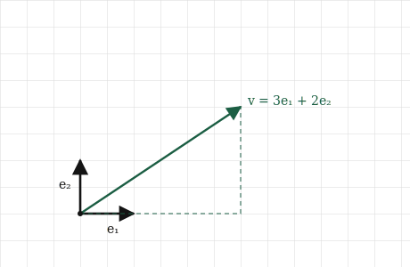
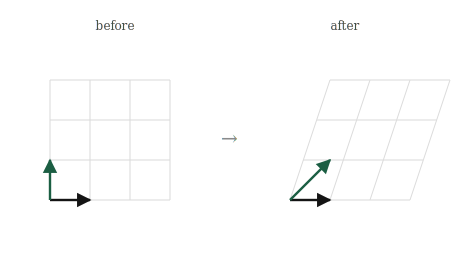

# Matrices as Transformations

## The itch {.unnumbered}

Everything we have done so far happens to one vector at a time. We measure a vector, we add two of them, we compare their directions. The vector sits still and we inspect it. But almost nothing interesting in machine learning leaves the vectors sitting still. The whole business is *moving* them: taking every data point and shifting it somewhere more useful, over and over, until points that were tangled together come apart.

Think about what a model actually does to its input. A face, as we said, arrives as a long list of pixel numbers, a vector in a space with far too many dimensions to picture. That raw vector is useless as it stands; the numbers are just brightnesses. What a network does, layer after layer, is *transform* that vector, reshaping the space it lives in so that by the end faces of the same person land near each other and different people land far apart. Nothing was added to the photo. The space was bent and stretched until the answer became easy to read off.

So we need to talk about transformations: not single vectors, but operations that take a whole space of vectors and move all of them at once. And we need the operation to be something a machine can store and apply, which means, as always, it has to come down to numbers.

Here is the surprise, and it is the heart of this part of the book. An enormous and useful class of these space-moving operations can each be captured completely by a small grid of numbers. Not approximately, completely: the entire behaviour of the transformation, what it does to every one of the infinitely many vectors in the space, is pinned down by a handful of numbers arranged in a box. That box is called a matrix, and this chapter is about the one idea that makes all of linear algebra click: a matrix is not a grid of numbers that happens to sit there. It is a thing that *moves space*, and the grid is only how we write the motion down.

## The picture {.unnumbered}

"Moving space" sounds like it should take an enormous amount of information. Space is full of vectors, infinitely many, and a transformation sends every one of them somewhere. To pin the operation down it seems we would have to list where each vector goes, and there is no end to them. But we do not have to, and the reason why is the whole trick.

Cast your mind back to the two reference vectors, $[1, 0]$ and $[0, 1]$, the ones pointing one step along each axis. We saw two chapters ago that every vector is built from them: the vector $[3, 2]$ is just three of the first plus two of the second, three steps east and two steps north. Every vector in the plane is some amount of $[1, 0]$ and some amount of $[0, 1]$. They are the two building blocks the whole space is assembled from, and they have a name for that reason, the **basis** vectors.

Now here is the move. Suppose our transformation is of the well-behaved kind we care about, the kind that keeps grid lines straight and evenly spaced and keeps the origin fixed. For a transformation like that, if we know only where the two basis vectors land, we know where *everything* lands. Watch why. The vector $[3, 2]$ was three of the first basis vector plus two of the second. After the transformation, it is still three of *wherever the first basis vector went* plus two of *wherever the second went*. The recipe, three of one and two of the other, survives the move untouched. Only the ingredients changed.

{#fig-basis-carries width=80%}

That is the entire idea, and it is worth saying slowly because everything rests on it. To describe a transformation of the whole plane, we do not list where infinitely many vectors go. We list where two vectors go. Two vectors, the images of $[1, 0]$ and $[0, 1]$, and the transformation is completely determined, because every other vector just rides along on the linear combination that already defined it.

So watch what a transformation does by watching what it does to the grid. Take the transformation that sends $[1, 0]$ to $[1, 0]$, leaving it alone, and sends $[0, 1]$ to $[1, 1]$, tilting the up-direction over to the right. The basis vectors have moved, and the whole grid moves with them: every square shears into a slanted parallelogram, the way a stack of paper slides when you push the top. No vector was moved by hand. They all followed the two that changed.

{#fig-shear width=80%}

Notice the restriction we slipped in: grid lines stay straight and evenly spaced, and the origin stays put. That is not a small print. It is the exact meaning of the word we have been circling since the second chapter. A transformation that keeps the grid straight and the origin fixed is precisely a **linear** one, and it is the reason lines stayed lines back when we first met the word. These well-behaved, grid-preserving, origin-fixing transformations are the only ones a matrix can describe, and they are the ones this whole part of the book is about.

## The math, built up {.unnumbered}

We said a transformation is pinned down by where the two basis vectors land. So to write a transformation as numbers, we just write down those two landing spots. That is all a matrix is.

Take the shear from the last section. It sent $[1, 0]$ to $[1, 0]$ and sent $[0, 1]$ to $[1, 1]$. Stack those two landing spots as columns, the image of the first basis vector on the left, the image of the second on the right:

$$
A = \begin{bmatrix} 1 & 1 \\ 0 & 1 \end{bmatrix}
$$

Read this the right way and it holds no mystery. The first column, $[1, 0]$ read downward, is where $[1, 0]$ went. The second column, $[1, 1]$, is where $[0, 1]$ went. The matrix is not a grid of anonymous numbers. It is a record of what happened to the basis, one landing spot per column. Anyone who hands you a matrix is really handing you the two arrows the basis turned into, written side by side.

Now applying the transformation to some vector, which we write as $A\mathbf{v}$, has to do the thing we already know: carry $\mathbf{v}$ along by its own recipe. If $\mathbf{v} = [x, y]$, then $\mathbf{v}$ was $x$ of the first basis vector plus $y$ of the second. After the transformation it is $x$ of the first landing spot plus $y$ of the second. So the result is a linear combination of the columns, with the entries of $\mathbf{v}$ as the amounts:

$$
A\mathbf{v} = x \begin{bmatrix} 1 \\ 0 \end{bmatrix} + y \begin{bmatrix} 1 \\ 1 \end{bmatrix}
$$

That is the whole operation, and it is worth pausing on how little it is. Multiplying a matrix by a vector is scaling each column of the matrix by the matching entry of the vector, and adding. It is the linear combination from the second chapter, wearing new notation. The matrix supplies the ingredients, its columns, and the vector supplies the amounts.

Let us carry it through with $\mathbf{v} = [3, 2]$:

$$
A\mathbf{v} = 3 \begin{bmatrix} 1 \\ 0 \end{bmatrix} + 2 \begin{bmatrix} 1 \\ 1 \end{bmatrix} = \begin{bmatrix} 3 \\ 0 \end{bmatrix} + \begin{bmatrix} 2 \\ 2 \end{bmatrix} = \begin{bmatrix} 5 \\ 2 \end{bmatrix}
$$

The vector $[3, 2]$ landed at $[5, 2]$. The shear pushed it to the right by an amount equal to its height, two, which is exactly what a shear should do, and we read that straight off the columns without memorising a single rule.

There is a mechanical way to write the same calculation, the one usually taught first: the top entry of the result is $1\cdot3 + 1\cdot2 = 5$, the bottom is $0\cdot3 + 1\cdot2 = 2$. Each entry of the result is a dot product of a row of the matrix with the vector. That row-by-row recipe is correct, it gives the same $[5, 2]$, and it is often the fastest way to compute by hand. But learn it as the *meaning* and the matrix goes dead: it becomes a grid of numbers you shuffle, and the space stops moving. The columns-as-landing-spots view is the one that keeps the geometry alive. The row view is for computing; the column view is for understanding.

None of this is confined to two dimensions. A transformation of three-dimensional space is fixed by where three basis vectors land, so its matrix has three columns. A transformation carrying a three-hundred-dimensional space somewhere is three hundred landing spots, a matrix three hundred columns wide, and $A\mathbf{v}$ is still the same thing: scale each column by the matching entry of $\mathbf{v}$ and add. The picture ended at two or three columns. The rule did not.

## Build it yourself {.unnumbered}

A matrix in NumPy is an array of rows, and applying it to a vector is a single operator. But the point of this chapter is the meaning, so we will compute the transformation both ways, by the column recipe and by the built-in, and watch them agree.

First, build the shear matrix. NumPy takes it row by row, so we type the two rows even though we have been thinking in columns:

```{python}
import numpy as np

A = np.array([[1, 1],
              [0, 1]])
print(A)
```

Keep the columns in mind as you read it. The first column, top-to-bottom, is `[1, 0]`, where the first basis vector landed. The second column is `[1, 1]`, where the second landed. NumPy stores it as rows on the page, but the transformation lives in the columns.

Now apply it to $[3, 2]$ the meaningful way, as a linear combination of the columns, scaling each column by the matching entry of the vector and adding:

```{python}
v = np.array([3, 2])

col1 = A[:, 0]      # first column: where [1,0] went
col2 = A[:, 1]      # second column: where [0,1] went

result = v[0] * col1 + v[1] * col2
print(result)
```

The answer is `[5, 2]`, the landing spot we worked out by hand. `A[:, 0]` pulls out the first column and `A[:, 1]` the second, and the line `v[0] * col1 + v[1] * col2` is the recipe read aloud: three of the first column plus two of the second. Nothing here is matrix magic. It is the linear combination from the second chapter, run on the columns of `A`.

NumPy has the operation built in, written with the `@` symbol:

```{python}
print(A @ v)
```

Same `[5, 2]`. The `@` is matrix application, and it is doing exactly the column recipe we just wrote out by hand, however it organises the arithmetic internally. We can put the two side by side to be sure:

```{python}
print(np.array_equal(v[0] * A[:, 0] + v[1] * A[:, 1], A @ v))
```

`True`. The meaning and the machine agree: applying a matrix is combining its columns.

To feel the transformation as motion rather than a single answer, apply the same matrix to several vectors and watch where they go:

```{python}
points = np.array([[1, 0],
                   [0, 1],
                   [1, 1],
                   [2, 1]])

for p in points:
    print(p, "->", A @ p)
```

Read the arrows. The first basis vector $[1, 0]$ stays put, as a shear should leave it. The second, $[0, 1]$, moves to $[1, 1]$, tilted right. The corner $[1, 1]$ slides to $[2, 1]$, and $[2, 1]$ to $[3, 1]$. Every point shifts right by an amount equal to its height, which is the shear, seen now not as one landing spot but as a whole set of points sliding in step.

And, as ever, none of this needed two dimensions. Give `A` three hundred columns and `v` three hundred entries, and `A @ v` still combines the columns by the entries of `v`, moving a vector through a space we could never picture, on the same one line.

## Where it lives in ML {.unnumbered}

Two chapters ago we said a neural network layer takes many linear combinations of its inputs, each with its own weights. We can now say what that pile of linear combinations actually is. It is a matrix.

A layer receives a vector, the outputs of the neurons before it. Each neuron in the layer forms one linear combination of that vector, using its own row of weights. Stack those rows up and you have a grid of numbers, one row per neuron, which is exactly a matrix. The whole layer, every neuron at once, is a single matrix applied to the incoming vector: $A\mathbf{v}$. The thing we built by hand in this chapter, scaling the columns and adding, is what runs when a network processes its input, billions of times over, at every layer of every model. When people say a model "has weights," the weights are the numbers in these matrices. Training a model is searching for the matrices that move the data the right way.

This reframes the whole picture of what a network is doing. Each layer is a transformation, a matrix that moves the space of vectors. The input starts as a point in some raw space, pixel brightnesses or word counts, where the thing we want is tangled up and hard to read. Layer by layer, matrix by matrix, the network carries that point through a sequence of transformations, each one bending and stretching the space a little more, until the point lands somewhere the answer is obvious. A network is a chain of the space-moving operations from this chapter, applied one after another.

Beyond neural networks, matrix transformations are everywhere the same way. Rotating an image, scaling it, flipping it, all of these are matrices applied to the vectors of pixel positions. Rotating a point cloud of data to line it up with its most important directions, which is the heart of a technique we will build later called PCA, is a matrix. Whenever data is reshaped, reoriented, or projected down to fewer dimensions, a matrix is doing it, and it is always the same operation underneath: combine the columns by the entries of the vector.

Now the limit, and it is the one we promised back when we first met linear combinations. A single matrix can only perform a linear transformation. It can stretch space, rotate it, shear it, flip it, but it cannot bend it. Straight grid lines stay straight, no matter what numbers we put in the matrix. And we saw two chapters ago that stacking linear steps changes nothing: apply one matrix, then another, and the combined effect is still a single linear transformation, still unable to bend. This is the same wall from before, now stated in matrices. A network that was nothing but matrices, however many layers deep, could only ever move space in straight-line ways, and most of the interesting structure in real data cannot be untangled that way.

Which is why, between one matrix and the next, a real network does one small non-linear step, the bending we have twice now set aside for later. The matrices do the moving; the bending step, applied between them, is what lets the moves accumulate into something a straight transformation never could. The matrix is the engine of the network, and it is exactly the operation from this chapter. The bend is what we build on top of it, and it is nearly the last thing this book assembles.

## Common misunderstandings {.unnumbered}

Matrices attract more confusion than anything so far, mostly because the notation invites you to forget they are transformations.

**In NumPy, `*` is not matrix application.** This is the direct cousin of the trap from the dot product chapter, and it bites just as often. The matrix operator is `@`. The star, `A * v`, does something else entirely: it multiplies elementwise, matching up entries and broadcasting, and it will happily return a wrong answer without any error. Watch the two disagree:

```{python}
import numpy as np

A = np.array([[1, 1],
              [0, 1]])
v = np.array([3, 2])

print(A @ v)      # matrix application: [5, 2]
print(A * v)      # elementwise, NOT what we want
```

The first is the transformation. The second is a grid of elementwise products that means nothing here. Reach for `@` when you want to apply a matrix, and treat a bare `*` between a matrix and a vector as a bug until proven otherwise.

**A matrix is not its grid of numbers; it is what they do.** It is tempting, once the numbers are on the page, to think of a matrix as the numbers. But two matrices with entries that look nothing alike can be nearly the same transformation, and two that look similar can do wildly different things. The numbers are a description of a motion, written in the language of where the basis lands. When you read a matrix, do not read the entries, read the columns, and ask where the basis went. That is the transformation; the grid is just its handwriting.

**Order matters: A then B is not B then A.** When we apply two transformations in turn, the order almost always changes the result. Rotate a vector and then stretch it, and you get one thing. Stretch it first and then rotate, and you generally get another. This is not a quirk of the arithmetic. It is a fact about actions in the world: putting on socks then shoes is not the same as shoes then socks. Because matrices are actions, they inherit this, and it means the order in which we multiply them is not free to shuffle. This is the single biggest difference between matrix arithmetic and the ordinary number arithmetic we grew up with, where order never mattered, and it is the thing the next chapter has to take seriously.

**A transformation fixes the origin, so a matrix cannot move it.** Every linear transformation leaves the origin where it is, because the origin is zero of every basis vector, and zero of anything is still zero. This has a consequence people trip on: a matrix alone cannot shift space sideways, cannot slide everything two steps to the right. That kind of move, a shift that does not fix the origin, is not linear and no matrix can express it on its own. It is a real and common operation, and when we need it we will have to add something to the matrix, not just choose different entries. For now the thing to hold is that a bare matrix pins the origin, always.

## Check your intuition {.unnumbered}

Try each before opening the answers. These ask you to read matrices as transformations, not to grind the arithmetic.

**1.** A matrix has columns $[1, 0]$ and $[0, 1]$, so $A = \begin{bmatrix} 1 & 0 \\ 0 & 1 \end{bmatrix}$. Where does it send the vector $[7, -3]$? What is this transformation doing to space?

**2.** A matrix sends the first basis vector to $[2, 0]$ and the second to $[0, 2]$. Write the matrix, and describe the transformation in one phrase.

**3.** A matrix sends $[1, 0]$ to $[0, 1]$ and sends $[0, 1]$ to $[-1, 0]$. Without computing anything further, what motion is this? Try applying it to $[1, 0]$ and picturing where it points afterwards.

**4.** Apply $A = \begin{bmatrix} 2 & 0 \\ 0 & 3 \end{bmatrix}$ to $[1, 1]$ using the column recipe: scale each column by the matching entry and add. What lands where, and why is this transformation not a rotation?

**5.** Someone claims a single matrix can take every point in the plane and slide it three units to the right, moving $[0, 0]$ to $[3, 0]$. Are they right?

::: {.callout-tip collapse="true"}
## Answers

**1.** It sends $[7, -3]$ to $[7, -3]$, unchanged. The columns are the untouched basis vectors, so the transformation leaves every vector exactly where it is. This is the identity, the transformation that does nothing, and its matrix is the one with ones down the diagonal and zeros elsewhere. Applying it is the matrix equivalent of multiplying a number by one.

**2.** The matrix is $\begin{bmatrix} 2 & 0 \\ 0 & 2 \end{bmatrix}$, the two landing spots as columns. It doubles the length of every vector while keeping its direction, so it is a uniform scaling, stretching the whole plane out from the origin by a factor of two. Every point moves twice as far from the centre, and the grid squares double in size without tilting.

**3.** It is a rotation by a quarter turn, ninety degrees counterclockwise. The first basis vector, pointing east, is sent to $[0, 1]$, pointing north. The second, pointing north, is sent to $[-1, 0]$, pointing west. Each basis vector has been swung a quarter turn counterclockwise, and since everything follows the basis, the whole plane turns with them. Reading the columns told us the motion without a single multiplication.

**4.** The columns are $[2, 0]$ and $[0, 3]$. Applying to $[1, 1]$ gives $1\cdot[2, 0] + 1\cdot[0, 3] = [2, 3]$. The transformation stretches the first axis by two and the second by three. It is not a rotation because it does not turn vectors rigidly; it stretches different directions by different amounts, distorting shapes rather than spinning them. A rotation keeps every length the same, and this changes them, so the two are different kinds of motion entirely.

**5.** No. Sliding every point three units right would move the origin from $[0, 0]$ to $[3, 0]$, but every linear transformation fixes the origin, because the origin is zero of the basis and no combination of the columns can escape zero when both amounts are zero. A bare matrix cannot perform this slide. It is a genuine and useful operation, but it needs more than a matrix, and building that "more" is a job we have deferred to later.
:::