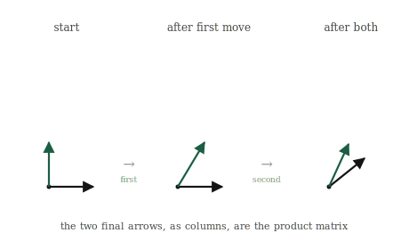

# Matrix Multiplication as Composition

## The itch {.unnumbered}

A single matrix moves space once. But we ended the last chapter noticing that a network does not move space once. It moves it again and again, matrix after matrix, each transformation handed the output of the one before. So the natural question is what happens when we chain two transformations together. Apply one matrix, then apply a second to the result. Two moves, back to back.

We could always do this the slow way: take a vector, apply the first matrix, take the answer, apply the second matrix, and read off where it ends up. That works, but it treats the two-step process as something we have to walk through in full every time. It would be far better if the *pair* of transformations were itself a single transformation, one matrix that does in one move what the two did in two. Then a whole stack of layers could collapse, at least in principle, into one operation we understand all at once.

It turns out the combination of two matrices is always itself a matrix, and finding it is what matrix multiplication actually is. Not a strange rule to memorise, but the answer to a concrete question: if I do this transformation and then that one, what single transformation have I done? That single combined transformation is the product of the two matrices, and this short chapter is about why it works the way it does.

## The picture {.unnumbered}

We already have everything we need to find the combined transformation, because we know the one fact that pins any transformation down: where the basis vectors land. A combined transformation is still a transformation, so it too is fixed entirely by where it sends the two basis vectors. We do not need to think about the infinitely many vectors in the plane. We need to follow two.

So take the basis vector $[1, 0]$ and push it through both moves in turn. First apply the earlier transformation and see where it goes. Then take that result and apply the later transformation to it. Wherever it ends up, after both moves, is where the *combined* transformation sends $[1, 0]$. Do the same for $[0, 1]$: push it through the first move, then the second, and note where it lands. Now we have both landing spots for the combined transformation, and by the rule from the last chapter, that is the combined transformation, completely. Written as columns, those two landing spots are the product matrix.

{#fig-compose width=85%}

That is genuinely all matrix multiplication is. To multiply two matrices is to ask where the basis ends up after both transformations have acted, first one then the other, and to record those final landing spots as the columns of a new matrix. Everything mechanical about the operation, every product and sum in the rule people memorise, is just the arithmetic of tracing the basis through twice.

The order is baked in and cannot be swapped, exactly as the last chapter warned. "First this transformation, then that one" is a different journey for the basis than "first that one, then this one," and the two journeys generally end in different places. So the two orders give different combined transformations, and different product matrices. When we write the product of two matrices, the order we write them in records which transformation happens first, and getting it backwards computes the wrong journey.

## The math, built up {.unnumbered}

Let us turn "trace the basis through both transformations" into arithmetic, and watch the famous rule assemble itself.

Call the first transformation $B$ and the second $A$, so we do $B$ first, then $A$. We want the combined matrix, and we know it column by column: its first column is where $[1, 0]$ ends up after both moves, its second column is where $[0, 1]$ ends up.

Where does $[1, 0]$ go? First $B$ acts on it. Applying a matrix to $[1, 0]$ just picks out that matrix's first column, because $[1, 0]$ is one of the first column and none of the second. So after $B$, our basis vector sits at $B$'s first column. Then $A$ acts on *that* vector. And applying $A$ to a vector is the operation we built last chapter: combine $A$'s columns using the vector's entries. So the first column of the combined matrix is $A$ applied to $B$'s first column. The second column is the same story with $[0, 1]$: it becomes $B$'s second column, then $A$ acts on that.

So the combined matrix is $A$ applied to each column of $B$, one column at a time. That is the entire rule, stated meaningfully:

$$
AB = \big[\; A(\text{first column of } B) \;\;\; A(\text{second column of } B) \;\big]
$$

Everything usually memorised is the arithmetic of those applications spelled out. Let us make it concrete. Take

$$
A = \begin{bmatrix} 0 & -1 \\ 1 & 0 \end{bmatrix}, \qquad B = \begin{bmatrix} 1 & 1 \\ 0 & 1 \end{bmatrix}
$$

where $A$ is a quarter-turn and $B$ is the shear from before. We do $B$ then $A$. Take $B$'s first column, $[1, 0]$, and apply $A$ by combining $A$'s columns: $1\cdot[0,1] + 0\cdot[-1,0] = [0, 1]$. Take $B$'s second column, $[1, 1]$, and apply $A$: $1\cdot[0,1] + 1\cdot[-1,0] = [-1, 1]$. Those two results are the columns of the product:

$$
AB = \begin{bmatrix} 0 & -1 \\ 1 & 1 \end{bmatrix}
$$

Now compare this to the rule as it is usually stated: each entry of the product is a row of $A$ dotted with a column of $B$. Check the top-left entry, first row of $A$ dotted with first column of $B$: $[0, -1]\cdot[1, 0] = 0$. It matches. That row-times-column recipe is not a separate fact to learn. It is exactly what "apply $A$ to each column of $B$" works out to, entry by entry, because applying a matrix produces each output entry as a dot product of a row with the input, which we saw last chapter. The dreaded rule is just our column-tracing, written out one number at a time.

There is one honest bookkeeping point the tracing makes obvious that the memorised rule hides. For the combination to make sense at all, $A$ has to be able to act on the columns of $B$. A column of $B$ lives in whatever space $B$ outputs into, and $A$ has to take vectors from exactly that space. If they do not match, there is no combined journey to speak of, and the product simply does not exist. This is the real reason two matrices can only be multiplied when the first one's width matches the second one's height. It is not an arbitrary shape rule. It is the requirement that the output of one transformation is a valid input to the next.

## Build it yourself {.unnumbered}

The product is `@`, the same operator we used to apply a matrix to a vector, now between two matrices. But the point of this chapter is that the product is column-tracing, so we build it that way first and check the operator agrees.

Here are the quarter-turn and the shear from the last section:

```{python}
import numpy as np

A = np.array([[0, -1],
              [1,  0]])     # quarter turn

B = np.array([[1, 1],
              [0, 1]])      # shear
```

We do $B$ first, then $A$, so we want $A$ applied to each column of $B$. Pull out $B$'s columns and send each one through $A$:

```{python}
col1 = A @ B[:, 0]     # A applied to B's first column
col2 = A @ B[:, 1]     # A applied to B's second column

combined = np.column_stack([col1, col2])
print(combined)
```

The two landing spots, stacked as columns, give the combined matrix. Now the built-in product:

```{python}
print(A @ B)
```

The same matrix. `A @ B` is doing exactly what we did by hand: applying $A$ to each column of $B$ and collecting the results as columns. We can put them side by side to be sure nothing differs:

```{python}
print(np.array_equal(combined, A @ B))
```

`True`. The operator and the column-tracing are one operation.

Now see the order dependence directly. We do the two transformations in the other order, $A$ first then $B$, which is the product $B @ A$, and compare:

```{python}
print(A @ B)
print(B @ A)
```

The two are different matrices. Doing the shear then the quarter-turn is a different combined transformation from the quarter-turn then the shear, and the arithmetic shows it plainly: swap the order and you get a different grid of numbers, because you asked for a different journey. This is the socks-and-shoes fact from the last chapter, now something we can watch NumPy confirm in two lines.

And, as everywhere else, none of this cares about size. Multiply a matrix that is three hundred wide by one that is three hundred tall and `@` still traces every basis vector through both transformations, composing two moves through a space we cannot picture into a single matrix, on the same one line.

## Where it lives in ML {.unnumbered}

This chapter is the reason a network can be deep. A deep network is, structurally, a long chain of transformations: the input vector enters, the first matrix moves it, the result is handed to the second matrix, which moves it again, and on down through the layers. "Deep" means many transformations composed one after another, and composition is the operation from this chapter. Every time a model passes data from one layer to the next, it is doing exactly the chaining we just built.

Seeing a network as composed transformations explains what the depth is *for*. One matrix can only reshape space in one linear way. But a sequence of transformations, each acting on the last one's output, can carry a point through a long, elaborate journey, reshaping the space in stages. The early layers make coarse moves, the later ones refine, and the composition of all of them is a single overall transformation from raw input to useful output. Depth is just a long composition, and this chapter is how the pieces join.

There is a practical payoff hiding in the fact that composition produces a single matrix. When a fixed sequence of linear transformations is applied to millions of data points, we do not have to push every point through every step. We can compose the whole sequence once, into one matrix, and then apply that single matrix to every point. The many-step journey and the one-step journey give identical results, because that is what composition means, but the one-step version does far less work. Collapsing a chain of transformations into one is a standard efficiency move, and it is only possible because the product of matrices is itself a matrix.

But this same collapsibility is the wall we have circled since the second chapter, and now we can state it exactly. If every layer were only a matrix, the entire network, however deep, would compose down to one matrix. All that depth would collapse into a single linear transformation, and the network could do no more than one layer could. Composition, the very thing that makes depth possible, is also what would make depth *pointless* if layers were purely linear. A thousand composed linear moves are still just one linear move.

This is the precise reason a real network places a small non-linear step between its matrices. That step breaks the collapsibility. With a bend between each pair of matrices, the layers can no longer be composed away into one, and the depth becomes real: each layer adds something the others cannot undo. The matrices supply the movement, composition chains them, and the non-linear steps are what stop the chain from collapsing. We have now met this bend three times as a promise. When we build it in Part 4, this is the collapse it exists to prevent.

## Common misunderstandings {.unnumbered}

Composition is a clean idea, but its notation is the most misleading we have met, and a couple of traps come with it.

**In $AB$, the right-hand matrix acts first.** This catches almost everyone. We read left to right, so $AB$ looks like it should mean "$A$, then $B$." It means the opposite. The product $AB$ applied to a vector is $A(B\mathbf{v})$: the vector meets $B$ first, and $A$ acts on the result. The reason is that the vector sits on the right, $AB\mathbf{v}$, so the matrix nearest it, $B$, reaches it first. When you read a chain of matrices, read the order of *action* from right to left, even though the symbols run left to right. Getting this backwards computes a different journey and a different answer, with nothing to warn you.

**You cannot multiply any two matrices.** Ordinary numbers multiply in any combination, but matrices carry shapes, and the shapes have to meet. The product $AB$ exists only when the output space of $B$ is the input space $A$ expects, which shows up as a dimension that has to match between them. When it does not match, there is no combined journey and no product; the operation is simply undefined. This is not a rule to memorise so much as a consequence of what composition is: the second transformation has to be able to receive what the first one produced.

**A product of matrices is a single matrix, not a stored to-do list.** Once we compute $AB$, the result is one matrix, one transformation, with no memory that it came from two. The two-step origin has been fully absorbed into one grid of numbers. This is exactly why the collapse from the last section works and why it saves computation. But it cuts both ways: given only the product, you cannot in general recover which two matrices were multiplied to make it, any more than knowing a sum is twelve tells you it was seven plus five. The composition flows one way, into the product, and does not come back out.

**Composition is not commutative, but it is associative.** We have leaned hard on order mattering, $AB \ne BA$, and that stays true. But a different rearrangement is always safe: when three or more transformations are chained, how you *group* them does not change the result. Doing $A$ after the combination of $B$ and $C$ is the same as doing the combination of $A$ and $B$ before $C$, as long as the left-to-right order is untouched. Order is fixed; grouping is free. This is why we can write a long chain of matrices with no brackets at all and compose them in whatever grouping is most convenient, which the efficiency trick from the last section quietly relied on.

## Check your intuition {.unnumbered}

Try each before opening the answers. These ask you to reason about composition, not to grind out products.

**1.** $A$ is a quarter-turn counterclockwise and $B$ is a stretch that doubles the horizontal axis. In the product $AB$, which transformation acts on a vector first?

**2.** You compose a transformation with the identity matrix, the one that does nothing. What is $AI$, and what is $IA$? Does order matter here?

**3.** A transformation $R$ rotates the plane by ninety degrees. What is $R$ composed with itself four times, $RRRR$, as a transformation? You should be able to answer without multiplying anything.

**4.** Someone computes $AB$ and $BA$ for two matrices and gets the same result both times. Have they necessarily made a mistake?

**5.** You have a fixed chain of three matrices that you must apply to a million data points. Describe two different orders of operations that give the same answers, and say which does less total work.

::: {.callout-tip collapse="true"}
## Answers

**1.** $B$ acts first. In the product $AB$ applied to a vector, the vector sits on the right as $AB\mathbf{v}$, so the nearest matrix, $B$, reaches it first, and $A$ acts on the result. The vector is stretched horizontally, then the stretched vector is turned a quarter-turn. Reading the action right to left is the habit to keep.

**2.** Both $AI$ and $IA$ equal $A$. Composing with the do-nothing transformation leaves the other transformation unchanged, whichever side it sits on, because doing nothing before a move or nothing after a move both leave you with just the move. So this is a case where order does not matter, and the identity is exactly the matrix that commutes with everything. It is the rare exception to order-dependence, and it earns that by doing nothing.

**3.** It is the identity, the transformation that leaves everything where it is. A quarter-turn done four times is a full turn of three hundred and sixty degrees, which brings every vector back to exactly where it started. No arithmetic is needed: four quarter-turns is one full rotation, and a full rotation is indistinguishable from doing nothing. This is a small taste of how thinking in transformations can outrun computing in numbers.

**4.** No. Order usually matters, but not always, and some pairs of transformations genuinely commute. Two rotations about the same centre commute, because turning by one angle then another lands you at the summed angle regardless of order. A stretch and the identity commute. Two stretches along the same axes commute. So $AB = BA$ is unusual but perfectly possible, and finding it does not imply an error; it means these two particular transformations happen not to interfere with each other.

**5.** Applying the chain point by point, you could push each of the million points through all three matrices in turn, which is three matrix-vector applications per point, three million in total. Or you could first compose the three matrices into a single matrix, one small piece of work done once, and then apply that single matrix to each of the million points, which is one application per point, a million in total. Both give identical answers, because composition preserves the result, but the second does roughly a third of the work. This is the collapse from the fifth section, and it relies on grouping being free even though order is fixed.
:::