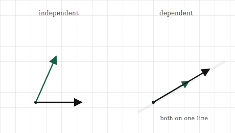
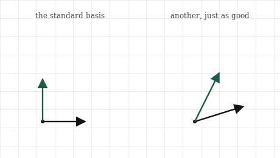

# Independence, Basis, and Rank

## The itch {.unnumbered}

We have been leaning on a word we never defined. Back when matrices arrived, we said every vector is built from the basis vectors $[1, 0]$ and $[0, 1]$, and that a transformation is pinned down by where those two land. We called them the basis and moved on. It was a loan, and this chapter pays it back.

The question underneath is one of redundancy, and it is worth feeling before we make it precise. Suppose someone hands you a set of vectors and says "these are the building blocks; everything you care about is made from combinations of these." A natural worry: are they all actually needed? Could one of them be thrown away without losing any reach, because it was already buildable from the others? Or worse, could the set be missing something, unable to build a region you needed?

Think of it in the terms from the span chapter. We saw that two vectors pointing different ways span the whole plane, but two vectors pointing the same way span only a line, because the second added no new direction. That second vector was redundant. It was already reachable from the first. So a pile of vectors can contain passengers, members that ride along without contributing any new reach, and it can also be too small to cover the space we care about.

This chapter is about getting that pile exactly right. We want to know when a set of vectors has no passengers, when it is the right size to build a space with nothing wasted and nothing missing, and how to count how much reach a set actually has. Those three questions have three names, independence, basis, and rank, and they are really one question about redundancy asked three ways.

## The picture {.unnumbered}

Start with the worry made visual. Two vectors that point different ways: between them they reach the whole plane, every point is some combination of the two. Neither is redundant, because neither can be built from the other. Take away either one and you drop from the whole plane down to a single line. Both are pulling their weight.

Now two vectors that point the same way, one just a stretched copy of the other. Together they reach only the line they both lie on. The second brings nothing new, because it was already a scaling of the first, already reachable. It is a passenger. A set with a passenger in it is called **dependent**: at least one member depends on the others, in the sense that it can be built from them and adds no reach. A set with no passengers, where every member contributes something the others cannot, is **independent**.

There is a clean way to see the difference that will matter for the arithmetic later. Take a dependent set, the two vectors on the same line. Because the second is a scaling of the first, we can combine them, with amounts that are not both zero, and arrive back at the origin: walk out along one and back along the other, and you cancel to nothing. For an independent set, this is impossible. The only way to combine two vectors pointing genuinely different ways and land back exactly at the origin is to use nothing of either, both amounts zero. So independence has a sharp test hiding in it: can a non-trivial combination reach zero, or can only the trivial all-zero combination do it?

{#fig-independence width=80%}

With independence in hand, a basis is the natural next step: it is an independent set that also reaches everything. Enough vectors to build the whole space, and not one more than needed. In the plane, any two independent vectors form a basis, because two independent vectors already span the whole plane. The familiar $[1, 0]$ and $[0, 1]$ are one basis, the simplest one, but they are not the only one; any two arrows pointing different ways will do. A basis is a complete set of building blocks with no waste: independent, so no passengers, and spanning, so nothing out of reach.

{#fig-basis width=80%}

Rank is the counting version of the same idea. Given a set of vectors, or the matrix whose columns they are, the rank is how many independent directions they actually reach, the number of building blocks that are genuinely pulling their weight once the passengers are set aside. Three vectors that all lie in a plane have rank two, not three, because for all their number they only reach a plane; one of them was a passenger. Rank ignores the head-count and measures the true reach.

## The math, built up {.unnumbered}

The picture gives us a sharp definition of independence, so let us state it. A set of vectors $\mathbf{v}_1, \mathbf{v}_2, \ldots, \mathbf{v}_k$ is **independent** when the only linear combination of them that equals the zero vector is the one where every amount is zero:

$$
c_1 \mathbf{v}_1 + c_2 \mathbf{v}_2 + \cdots + c_k \mathbf{v}_k = \mathbf{0}
\quad\text{forces}\quad
c_1 = c_2 = \cdots = c_k = 0.
$$

Read it through the picture. A combination reaching the zero vector means walking out along the vectors, scaled by the amounts, and arriving back at the origin. If the only way to do that is to use none of any of them, no vector was secretly cancelling against the others, so none was a passenger, and the set is independent. If some non-zero amounts also land at zero, then one vector was expressible through the rest, and the set is dependent. The whole notion of redundancy is captured by this one equation about reaching zero.

A **basis** for a space is then an independent set that spans it. Two conditions, and they pull against each other in a useful way. Spanning wants enough vectors to reach everything; independence wants few enough that none is wasted. A basis is where those two meet: exactly enough. This forces a fact that feels surprising at first and then obvious. Every basis of a given space has the same number of vectors. You cannot build the plane with three independent vectors, there is no room, the third is always dependent on the other two; and you cannot span it with one. The plane's bases all have exactly two vectors. That fixed number is the **dimension** of the space, the word we have used loosely finally given a precise meaning: the dimension is the size of any basis.

**Rank** is the same count applied to whatever set of vectors you actually have, which need not be a basis. The rank of a set of vectors, or of the matrix holding them as columns, is the size of the largest independent subset, the number of genuinely independent directions among them. A rank equal to the number of vectors means no passengers, the set is independent. A rank below the number of vectors means some are redundant, and the gap is how many. For a matrix, rank measures how many independent directions its columns can reach, which is the true dimensionality of the space the transformation can produce, regardless of how many columns are written down.

## Build it yourself {.unnumbered}

Independence, rank, and dimension all come down to counting genuinely independent directions, and NumPy will count them for us. But first let us catch a dependent set in the act, the way the definition describes.

Here are two vectors on the same line, the second a clean multiple of the first:

```{python}
import numpy as np

v1 = np.array([1.0, 2.0])
v2 = np.array([3.0, 6.0])     # exactly 3 * v1
```

The definition said a set is dependent when some combination, with amounts not all zero, reaches the zero vector. Here we can see the amounts by eye: three of $v_1$ minus one of $v_2$ cancels to nothing.

```{python}
print(3 * v1 - 1 * v2)
```

Zero, and the amounts were $3$ and $-1$, not both zero. That non-trivial path to the origin is dependence, caught in the act. For an independent pair no such non-zero amounts exist; only $0$ and $0$ would land on zero.

Counting the independent directions in a set is exactly what rank measures, and NumPy computes it directly:

```{python}
dependent = np.column_stack([v1, v2])
print(np.linalg.matrix_rank(dependent))
```

Rank one. Two vectors written down, but only one independent direction between them, because the second was a passenger. Now an independent pair:

```{python}
w1 = np.array([1.0, 2.0])
w2 = np.array([2.0, 1.0])     # not a multiple of w1
independent = np.column_stack([w1, w2])
print(np.linalg.matrix_rank(independent))
```

Rank two. Two vectors, two genuine directions, no passengers, so these two form a basis for the plane. The rank matching the number of vectors is the signal that a set is independent.

The same tool sees through a bigger, more deceptive case. Here are three vectors in three-dimensional space, and at a glance they look independent, three different-looking lists:

```{python}
a = np.array([1.0, 0.0, 0.0])
b = np.array([0.0, 1.0, 0.0])
c = np.array([1.0, 1.0, 0.0])     # a + b, a hidden passenger
M = np.column_stack([a, b, c])
print(np.linalg.matrix_rank(M))
```

Rank two, not three. The third vector is $a + b$, buildable from the first two, so for all its different appearance it adds no new direction. All three lie in the same flat plane inside the space, and the rank reports the truth the eye missed: two independent directions, not three. This is why rank matters. In high dimensions we cannot see which vectors are passengers, and a set can look full while secretly collapsing into a smaller space. Rank counts what is really there.

## Where it lives in ML {.unnumbered}

Redundancy among features is one of the most common quiet problems in real data, and rank is how it is detected. Suppose a dataset has a column for temperature in Celsius and another for the same temperature in Fahrenheit. Two columns, but one is a fixed transformation of the other, a passenger in the exact sense of this chapter. They add no independent information. A model handed both is carrying a redundant direction, and the matrix of features is rank-deficient: fewer independent directions than columns.

This is not a curiosity; it breaks things. Several standard methods assume the feature directions are independent, and when they are not, the methods become unstable or fail outright. The clean example is the one we deferred back at the dot product: fitting a linear model involves, under the hood, undoing a transformation, and that undoing is only possible when the relevant vectors are independent. Feed in redundant features and the undoing has no unique answer, because a dependent set does not pin down a single solution. The model cannot decide how to split influence between two columns that say the same thing, and the result is wild, arbitrary weights. Detecting and removing the redundancy, checking the rank, is part of preparing data honestly.

Rank also names something we will meet as a goal rather than a warning. Often a dataset has a thousand features but a much lower true rank: the data looks high-dimensional but really lives in a far smaller number of independent directions, with the rest built from those. This is the hope behind dimensionality reduction. If the true rank is low, we can throw away the redundant directions and keep the few that carry the information, shrinking a thousand numbers to a few dozen with almost no loss. The entire idea rests on the gap between how many features are written down and how many independent directions the data actually spans, which is to say, on rank. When we reach PCA and SVD, this gap is the thing we exploit.

And there is a deeper appearance in the study of neural networks, close to the questions this book was written alongside. The transformations a network learns have ranks, and a low-rank transformation is one that collapses its input into a smaller space of directions, discarding the rest. Whether that collapse is helping the model generalise or quietly destroying information it needed is an active question, and reading it requires exactly the notion of rank built here: how many independent directions survive a transformation, and how many are lost.

## Common misunderstandings {.unnumbered}

**Independence is about the whole set, not about pairs.** It is tempting to check independence by looking at vectors two at a time: no vector is a multiple of any other, so the set must be independent. This fails. Three vectors can be pairwise non-multiples and still be dependent, if one is a combination of the other two. The vector $[1, 1]$ is neither a multiple of $[1, 0]$ nor of $[0, 1]$, yet it is their sum, so the three together are dependent. Independence is a property of the entire set at once, whether any combination of all of them reaches zero, not a fact you can verify by pairs.

**A basis is not unique.** The standard basis $[1, 0]$ and $[0, 1]$ is so familiar that it can seem like *the* basis, the true coordinates of the plane. It is one basis among infinitely many. Any two independent vectors form a basis, and each choice is a different, equally valid set of coordinates for the same space. The standard basis is convenient, not privileged. Much of the power in later chapters comes from deliberately choosing a different basis in which a problem looks simpler, which only makes sense once you accept the standard one holds no special claim.

**Rank counts directions, not vectors, and not non-zero entries.** Rank is easy to confuse with simpler counts. It is not the number of vectors, which can exceed the rank when passengers are present. It is not the number of non-zero entries, nor the number of columns that happen to look different. Rank is strictly the number of independent directions the set reaches, which requires seeing through combinations, not just scanning the vectors. This is exactly why we need a real computation for it in high dimensions, where the redundancy is invisible.

**Dimension is a property of the space, rank is a property of your particular set.** These blur together because in the nicest case they coincide, an independent set spanning the whole plane has rank two and the plane has dimension two. But they answer different questions. Dimension asks how many directions the space has room for; rank asks how many your specific vectors actually reach. A set of vectors in three-dimensional space can have rank one, two, or three. The space's dimension is fixed at three; your set's rank depends on what you brought.

## Check your intuition {.unnumbered}

Try each before opening the answers.

**1.** Are the vectors $[2, 0]$ and $[0, 5]$ independent? Are $[2, 0]$ and $[4, 0]$? Answer from the picture, not a computation.

**2.** A set contains the zero vector along with two other, genuinely different vectors. Can the set be independent? Think about what combination could reach the origin.

**3.** Three vectors live in the plane, ordinary two-dimensional space. Can they be independent? What does this say about their rank?

**4.** A matrix has four columns, but its rank is two. In plain terms, what does that tell you about the columns?

**5.** You measure the rank of a $1000 \times 1000$ matrix of data and find it is $40$. What does this suggest about the data, and why might you be pleased to discover it?

::: {.callout-tip collapse="true"}
## Answers

**1.** The first pair is independent: $[2, 0]$ points along one axis and $[0, 5]$ along the other, two different directions, neither buildable from the other. The second pair is dependent: $[4, 0]$ is just $[2, 0]$ scaled by two, the same direction, a passenger. Both vectors of the second pair lie on the horizontal axis and reach only that line.

**2.** No, it cannot be independent. The zero vector is always a passenger, because you can take some amount of it, any amount at all, and none of the others, and still sit at the origin: five times the zero vector is zero. That is a non-trivial combination reaching zero, one amount non-zero, which is exactly what dependence means. Any set containing the zero vector is automatically dependent.

**3.** No, three vectors in the plane can never be independent. The plane has dimension two, so any basis has two vectors, and no independent set can be larger than a basis. A third vector in the plane is always buildable from two independent ones already there. So three vectors in the plane have rank at most two: at least one is a passenger, no matter which three you pick.

**4.** Two of the four columns are redundant. The columns reach only two independent directions, so whatever the other two columns are, they are combinations of those two, buildable from them and adding no new reach. The matrix's transformation, despite having four columns to work with, can only produce a two-dimensional space of outputs.

**5.** The data has a thousand features but only forty independent directions; the other nine hundred and sixty are, in effect, combinations of those forty. The data looks high-dimensional but truly lives in a small subspace. You would be pleased because it means the data is highly compressible: you could keep forty directions and discard the rest with little loss, turning a thousand-number representation into something far smaller and easier to work with. A low rank in a large matrix is an opportunity, and finding it is the premise of dimensionality reduction.
:::