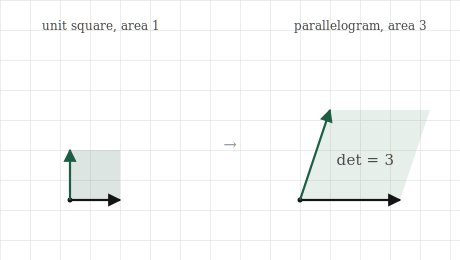
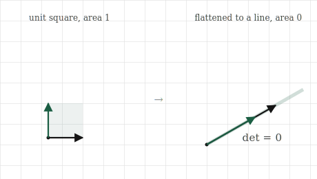

# The Determinant

## The itch {.unnumbered}

A matrix moves space. It stretches, rotates, shears, flips. Watching the basis vectors land tells us exactly where everything goes, but it does not, at a glance, tell us one simple thing we often want to know: did the transformation make things bigger or smaller, and by how much?

Picture a transformation acting not on a single vector but on a whole region, say the unit square, the little square with corners at the origin, $[1,0]$, $[0,1]$, and $[1,1]$. Apply a matrix and that square becomes some new shape, a parallelogram, tilted and resized. It has an area. The question is how that area compares to the square we started with. Did the transformation double the area, halve it, leave it alone? A single number answers this for the whole transformation, and it turns out to answer far more than the question that produced it.

That number is the determinant. It is the factor by which a transformation scales area, and packed into that one idea are a surprising number of the things we most want to know about a matrix: whether it flips space over, whether it flattens space into something lower-dimensional, and whether the transformation can be undone at all. This short chapter builds the determinant from the one question of area, and then reads those other answers straight off it.

## The picture {.unnumbered}

Begin with the unit square, area one. Apply a transformation and it becomes a parallelogram, the one whose two sides are the landing spots of the basis vectors, the two columns of the matrix. The determinant is simply the area of that parallelogram, compared against the square we started with.

If the parallelogram has area three, the determinant is three: the transformation triples areas. Not just the area of this one square, but every area in the plane, because the transformation treats space uniformly. A region of area five would become area fifteen under the same matrix. The determinant is a single scaling factor that applies everywhere at once. If the parallelogram has area one half, the determinant is one half, and the transformation shrinks every area to half its size.

{#fig-det-area width=80%}

Now the case that carries the most meaning. Suppose the transformation sends both basis vectors onto the same line, as it would if its two columns pointed the same way. The unit square is flattened completely, squashed onto a line, and a line has no area. Its area is zero, so the determinant is zero. A determinant of zero is the signature of a transformation that collapses space, flattening the plane onto a line or onto a single point, destroying a dimension in the process.

This should connect immediately to the last chapter. A transformation whose columns point the same way is one whose columns are dependent, a rank-deficient transformation. So a zero determinant and rank deficiency are the same event seen from two angles: the columns fail to be independent, the space they reach collapses to something lower-dimensional, and the area of that collapsed image is zero. The determinant gives us a single number that detects the collapse we learned to count with rank.

{#fig-det-collapse width=80%}

There is one more thing the area quietly carries, a sign. If a transformation flips the plane over, like turning a page, reflecting left and right, it reverses orientation, and we record this by letting the determinant go negative. A determinant of $-2$ means areas are doubled and space is flipped. The size of the determinant is the area factor; the sign tells us whether the transformation preserved the plane's handedness or turned it over. For now the magnitude is the main story, but the sign is a genuine part of the number, not an accident.

## The math, built up {.unnumbered}

For a two-by-two matrix, the area of the parallelogram has a short formula, and it is the one piece of determinant arithmetic worth knowing by heart. If

$$
A = \begin{bmatrix} a & b \\ c & d \end{bmatrix},
$$

then its determinant is

$$
\det(A) = ad - bc.
$$

The columns are $[a, c]$ and $[b, d]$, the two sides of the parallelogram, and $ad - bc$ is exactly the area that parallelogram encloses, carrying its sign. We will not grind through the geometric derivation of why this particular combination gives the area; it comes from the base-times-height of the parallelogram worked out in coordinates, and the details are in the appendix. What matters is reading it and trusting what it measures.

Test it against the cases we can already see. The identity matrix, which leaves everything alone, is $a = 1, b = 0, c = 0, d = 1$, giving $\det = 1\cdot1 - 0\cdot0 = 1$. Area unchanged, exactly right for a transformation that does nothing. A matrix that doubles both axes, $a = 2, d = 2$, others zero, gives $\det = 4$: doubling each of two dimensions quadruples area, which matches doubling the side of a square. And a collapse, columns $[1, 2]$ and $[2, 4]$ where the second is twice the first, gives $\det = 1\cdot4 - 2\cdot2 = 0$: the zero that signals the square flattened onto a line.

In three dimensions the determinant measures a volume rather than an area, the volume of the parallelepiped that the unit cube becomes, and the formula grows longer, but the meaning is identical: the factor by which the transformation scales volume, zero when it collapses the cube flat. In any number of dimensions the determinant is the single number for how the transformation scales content, whatever the word for content is in that many dimensions, and zero always means collapse. The formula gets more elaborate; the idea does not move.

## Build it yourself {.unnumbered}

The determinant is one function call, but let us confirm the geometry first: the two-by-two formula really does give the parallelogram's scaling, and zero really does mark collapse.

Start with the hand formula on a matrix that doubles areas:

```{python}
import numpy as np

A = np.array([[2.0, 0.0],
              [0.0, 2.0]])

a, b = A[0, 0], A[0, 1]
c, d = A[1, 0], A[1, 1]
print(a * d - b * c)
```

Four, as we reasoned: doubling both axes scales area by four. NumPy has it built in:

```{python}
print(np.linalg.det(A))
```

The same four. Now watch a collapse. Here is a matrix whose second column is twice the first, so its columns are dependent:

```{python}
collapse = np.array([[1.0, 2.0],
                     [2.0, 4.0]])
print(np.linalg.det(collapse))
```

Zero, give or take the faint floating-point dust these computations leave. The determinant has detected that this transformation flattens the plane onto a line. And it agrees with what rank says about the same matrix:

```{python}
print(np.linalg.matrix_rank(collapse))
```

Rank one: one independent direction, the collapse counted the other way. The zero determinant and the deficient rank are the same fact, reported by two different tools.

Finally the sign, the orientation flip. Here is a matrix that swaps the two axes, sending $[1,0]$ to $[0,1]$ and $[0,1]$ to $[1,0]$, which reflects the plane:

```{python}
flip = np.array([[0.0, 1.0],
                 [1.0, 0.0]])
print(np.linalg.det(flip))
```

Negative one. The magnitude one says areas are preserved, nothing is stretched, and the negative sign says the plane was turned over in the process. The determinant reported both the size and the flip in a single number.

## Where it lives in ML {.unnumbered}

The determinant's largest role in machine learning is as an alarm bell. A zero determinant means a transformation has collapsed space, and collapse is exactly the condition under which many operations fail. The clearest case is inverting a matrix, undoing a transformation. If a transformation flattened the plane onto a line, there is no way to undo it, because everything that landed on a given point of the line came from a whole set of different starting points, and undoing cannot know which one to return to. Information was destroyed in the collapse, and no inverse can recover it. The determinant being zero is the precise signal that a transformation cannot be undone, which we will lean on heavily in the next chapter when we ask when a system of equations has a unique answer.

In practice the danger is rarely a determinant of exactly zero. It is a determinant very close to zero, which signals a transformation that nearly collapses space, squashing it almost but not quite flat. Undoing such a transformation is possible in principle but treacherous in practice: tiny errors in the input get magnified enormously, because the near-collapse has to be violently un-squashed. A matrix with a near-zero determinant is called ill-conditioned, and it is a well-known source of numerical trouble in machine learning, where models that require inverting such a matrix produce wildly unstable results. Watching the determinant, or quantities related to it, is part of knowing whether a computation can be trusted.

There is a second appearance, more specialised, in models that transform probability distributions. Some modern generative models work by taking a simple distribution and pushing it through a transformation to produce a complicated one. When you stretch or squash space, you stretch or squash the probability density living in it, and the factor by which the density changes is exactly the determinant of the transformation. These models have to compute determinants constantly, to keep track of how the probability mass is being redistributed as it flows through each step. The area-scaling idea from a unit square turns out to be the accounting that keeps such a model honest about where its probability went.

## Common misunderstandings {.unnumbered}

**The determinant is a property of a transformation, not a number you read off the entries.** The formula $ad - bc$ makes the determinant look like just an arithmetic combination of the matrix entries. It is really the area-scaling factor of the transformation, and the arithmetic is only how we compute it. Two matrices with quite different entries can have the same determinant, because they scale area by the same factor while doing different things to space. Read the determinant as what the transformation does to content, not as a sum of products.

**A zero determinant does not mean the transformation sends everything to zero.** Collapse means the plane is flattened onto a line, or three-dimensional space onto a plane, not that everything is sent to the origin. A great many points survive a collapse; they just all get squashed onto a lower-dimensional space. The image is a line full of points, not a single point. Zero determinant means zero *area*, not zero output.

**Never test a determinant for exact equality with zero in code.** The collapse case in our own experiment did not print a clean zero; it printed a speck of floating-point dust, something like $-2 \times 10^{-16}$. This is the approximate arithmetic we have met before, and it means a test like `det == 0` will almost always answer `False` even for a genuinely collapsed matrix, because the computed value is a hair off. The honest check is whether the determinant is *close* to zero, small compared to the scale of the matrix, not exactly equal to it. Exact-zero tests on computed determinants are a reliable way to be quietly wrong.

**A large determinant does not mean a "big" or "important" matrix.** The determinant measures area scaling, nothing more. A matrix can have enormous entries and a determinant of zero, if it collapses space, and a matrix can have a modest determinant while stretching one direction enormously and squashing another, since the determinant reports only the *product* of the stretches, the net effect on area. It is not a measure of size or significance. For how much a transformation stretches individual directions, we will need the singular values of a later chapter; the determinant only ever reports their combined effect on area.

## Check your intuition {.unnumbered}

Try each before opening the answers.

**1.** A transformation has determinant $5$. You apply it to a shape of area $2$. What is the area of the result?

**2.** A two-by-two matrix has columns $[3, 1]$ and $[6, 2]$. Without computing $ad - bc$, what do you expect its determinant to be, and why?

**3.** A transformation has determinant $-1$. What does it do to areas, and what does the sign tell you?

**4.** Matrix $A$ has determinant $3$ and matrix $B$ has determinant $4$. You apply $B$ first, then $A$. By what factor does the combined transformation scale area?

**5.** You are about to invert a matrix as part of fitting a model, and you notice its determinant is $0.0000001$, very close to zero. Should you be comfortable? What does this tell you about the computation ahead?

::: {.callout-tip collapse="true"}
## Answers

**1.** Ten. The determinant is the factor by which every area is scaled, so an area of two becomes $2 \times 5 = 10$. The determinant applies uniformly to every region, whatever its shape or size.

**2.** Zero. The second column $[6, 2]$ is exactly twice the first column $[3, 1]$, so the two columns point the same way, are dependent, and the parallelogram they form is flattened onto a line with no area. A collapse like this always has determinant zero, and you can see it from the columns without touching the formula. (The arithmetic confirms it: $3\cdot2 - 6\cdot1 = 0$.)

**3.** It preserves areas, since the magnitude of the determinant is one, and it flips the plane over, since the sign is negative. Nothing is stretched or shrunk; the shape keeps its size but its orientation is reversed, like a reflection in a mirror. Size from the magnitude, handedness from the sign.

**4.** Twelve. Composing transformations multiplies their area-scaling factors: the first scales area by four, and the second scales that already-scaled area by three, for a total of $4 \times 3 = 12$. Determinants of composed transformations multiply, which is exactly what you would expect from scaling an area and then scaling it again.

**5.** You should be wary. A determinant that close to zero means the matrix nearly collapses space, and inverting a near-collapse is numerically dangerous: small errors in your data will be magnified dramatically in the result, and the model's output may be unstable and untrustworthy. The matrix is ill-conditioned. It is not strictly impossible to proceed, but the near-zero determinant is a warning that the computation ahead is fragile and the answer may not mean what you hope.
:::