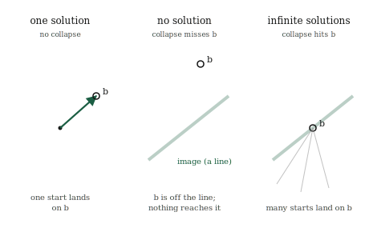

# Systems of Equations, Geometrically

## The itch {.unnumbered}

Somewhere in school most of us met equations like $2x + 3y = 12$ and $x - y = 1$, two equations, two unknowns, and were taught to grind them into a solution by elimination or substitution. It worked, but it was arithmetic in the dark. Nothing about the procedure said what we were really doing or why an answer existed. We have spent six chapters building the machinery to see it clearly, and now the whole subject snaps into a single picture.

Here is the reframing. Stack those equations into a matrix acting on a vector of unknowns. The two equations above are exactly

$$
\begin{bmatrix} 2 & 3 \\ 1 & -1 \end{bmatrix}
\begin{bmatrix} x \\ y \end{bmatrix}
=
\begin{bmatrix} 12 \\ 1 \end{bmatrix},
$$

which is just $A\mathbf{x} = \mathbf{b}$. Read it as a transformation. The matrix $A$ is a transformation, $\mathbf{x}$ is some unknown vector, and $\mathbf{b}$ is where $\mathbf{x}$ lands after $A$ acts on it. We know the transformation and we know the destination. The question is where we started: which vector $\mathbf{x}$ does the transformation $A$ send to $\mathbf{b}$?

That is what solving a system of equations is. Not grinding through elimination, but running a transformation backwards: given where something landed, find where it began. And once we see it this way, everything we already know about transformations, whether they collapse space, whether they can be undone, what their determinant and rank say, tells us immediately whether the system has one answer, no answer, or infinitely many. The dark arithmetic becomes a question about undoing a known motion.

## The picture {.unnumbered}

Think of $A\mathbf{x} = \mathbf{b}$ as a search. The transformation $A$ takes every vector somewhere. We are told that some particular vector $\mathbf{x}$ was taken to $\mathbf{b}$, and we want that $\mathbf{x}$ back. If we could run $A$ in reverse, we would apply the reverse to $\mathbf{b}$ and arrive at $\mathbf{x}$ directly. So solving the system is really asking whether $A$ can be run in reverse, and if so, running it.

For a well-behaved transformation, one that does not collapse space, running it in reverse always works, and works uniquely. Every output came from exactly one input, because a non-collapsing transformation never sends two different vectors to the same place. So there is a single vector that lands on $\mathbf{b}$, and the system has exactly one solution. Geometrically, $A$ stretched and rotated and sheared space without flattening it, so we can perfectly undo those moves and walk $\mathbf{b}$ back to its unique origin.

Now the case where it breaks, and it is the collapse from the last two chapters. Suppose $A$ flattens the plane onto a line, a rank-deficient, zero-determinant transformation. Then many different input vectors all get squashed onto the same output. Running the transformation backwards is no longer well-defined: given a point on the line, we cannot say which of the many vectors that landed there was our $\mathbf{x}$. And here the destination $\mathbf{b}$ decides between two fates.

If $\mathbf{b}$ does not even lie on the line that $A$ squashes everything onto, then nothing maps to $\mathbf{b}$ at all. No input lands there, so there is no solution. The equations are asking for a vector that cannot exist, like asking which vector a flattening sends to a point floating off the line, when the flattening only ever produces points on the line.

If $\mathbf{b}$ does lie on that line, the opposite problem appears. Not one vector maps to it but a whole infinite family of them, the entire set of inputs that got squashed onto that point. The system has infinitely many solutions, a whole line of them, and no single answer can be singled out. Collapse turns one clean answer into either none or endlessly many, and which one depends on whether the target survived the collapse.

{#fig-three-fates width=85%}

So the three possibilities of a linear system, the one solution, no solution, and infinitely many that the old elimination method produced as mysterious special cases, are not mysterious at all. They are whether the transformation collapses, and if it does, whether the target lies inside the collapsed image. Everything is read off the geometry.

## The math, built up {.unnumbered}

Running a transformation backwards has a name and a notation. When $A$ does not collapse space, there is another transformation that undoes it, called the **inverse** of $A$ and written $A^{-1}$. It is the transformation that takes every landing spot back to where it came from, so that applying $A$ and then $A^{-1}$ returns every vector unchanged. With it, the solution to the system is immediate:

$$
A\mathbf{x} = \mathbf{b}
\quad\Longrightarrow\quad
\mathbf{x} = A^{-1}\mathbf{b}.
$$

Apply the undoing transformation to the destination, and you arrive at the unique start. That is the entire solution when the inverse exists, compressed into one line: to solve the system, run the transformation backwards on $\mathbf{b}$.

The inverse exists exactly when the transformation does not collapse space, which we now have several equivalent ways to state, all saying the same thing. The inverse exists when the determinant is non-zero, because a zero determinant is collapse. It exists when the columns are independent, when the matrix has full rank, because dependence is collapse counted another way. A matrix with an inverse is called **invertible**, and invertible, non-zero determinant, full rank, and independent columns are four names for one property: the transformation preserves space instead of flattening it, so it can be undone.

When that property fails, the inverse does not exist, and the notation $A^{-1}$ simply has nothing to refer to. There is no single transformation that undoes a collapse, because the collapse destroyed the information needed to undo it. This is why a system with a collapsing $A$ has no clean solution: the very object that would produce the answer, $A^{-1}$, cannot be formed. The system might still have solutions, the infinitely many of the previous section, but they cannot be reached by inverting, because there is nothing to invert.

We will not write out the formula for computing an inverse by hand. For the two-by-two case it is short, a rearrangement of the entries divided by the determinant, which already shows the trouble: the determinant sits in the denominator, so a zero determinant means dividing by zero, and the inverse blows up exactly when the transformation collapses. That single fact, the determinant in the denominator, is the arithmetic shadow of everything the picture told us. In practice the inverse is computed by machine, and often not computed at all, because there are cheaper ways to solve $A\mathbf{x} = \mathbf{b}$ than by building the whole inverse transformation. But the meaning is what matters: solving is undoing, and undoing is possible exactly when the transformation did not collapse.

## Build it yourself {.unnumbered}

Let us solve a system by running the transformation backwards, and then watch what happens when the transformation collapses.

Here is the system from the start of the chapter, as a matrix and a target:

```{python}
import numpy as np

A = np.array([[2.0, 3.0],
              [1.0, -1.0]])
b = np.array([12.0, 1.0])
```

The determinant is non-zero, so $A$ does not collapse space and can be run backwards. We can form the inverse and apply it to $\mathbf{b}$, exactly as the formula $\mathbf{x} = A^{-1}\mathbf{b}$ says:

```{python}
A_inv = np.linalg.inv(A)
x = A_inv @ b
print(x)
```

The solution is $[3, 2]$: the transformation $A$ sends the vector $[3, 2]$ to $[12, 1]$, and we recovered it by undoing $A$. We can check by going forwards again, applying $A$ to our answer and confirming it lands on $\mathbf{b}$:

```{python}
print(A @ x)
```

Back to $[12, 1]$, the destination we were given. The undoing was correct.

In real work you rarely build the inverse; you ask the solver for $\mathbf{x}$ directly, which is faster and steadier:

```{python}
x = np.linalg.solve(A, b)
print(x)
```

The same $[3, 2]$. `np.linalg.solve` runs the transformation backwards without constructing the whole inverse transformation, which is the method to reach for in practice.

Now a collapsing system. Here the two rows describe the same direction, the second just twice the first, so $A$ flattens the plane:

```{python}
A_bad = np.array([[1.0, 2.0],
                  [2.0, 4.0]])
b_bad = np.array([3.0, 99.0])

print(np.linalg.det(A_bad))
```

A determinant of zero, the signature of collapse. Asking to undo it fails, because there is nothing to undo:

```{python}
try:
    np.linalg.inv(A_bad)
except np.linalg.LinAlgError as e:
    print("no inverse:", e)
```

The library refuses, reporting a singular matrix, which is the formal word for a collapsing, non-invertible transformation. The geometry predicted this exactly: a flattened transformation cannot be run backwards, so the system it defines has no clean solution to hand back.

## Where it lives in ML {.unnumbered}

Solving $A\mathbf{x} = \mathbf{b}$ is not a side-topic in machine learning; it is close to the centre of it. An enormous amount of what models do, especially the classical ones, comes down to setting up a system of linear equations and solving it. The most direct case is linear regression, the workhorse we will build in Part 4. Fitting a straight relationship to data turns into a system of exactly this form, and the best-fit answer is found by solving it, by running a transformation backwards to recover the weights that produced the data.

But real data makes the story richer than the clean three-fates picture, and the enrichment is worth seeing now. When we fit a model, we usually have far more equations than unknowns, one equation per data point and only a handful of weights to find, thousands of demands on a few numbers. Such a system almost never has an exact solution. The equations contradict each other slightly, because real data is noisy, and no single choice of weights satisfies all of them at once. In the strict sense of this chapter, there is no solution: the target $\mathbf{b}$ does not lie exactly in the reachable image.

Rather than give up, we change the question. Instead of demanding a vector that lands exactly on $\mathbf{b}$, we look for the one that lands as close to $\mathbf{b}$ as possible, closest in the straight-line distance we built back with the L2 norm. This is the least-squares solution, and it is what fitting a model actually computes: not the impossible exact answer, but the nearest reachable one. The whole of linear regression is this move, and it leans on two ideas from earlier chapters at once, the reachable image from this one and the notion of closeness from the norms chapter. We are not ready to build it fully, but notice that the machinery is nearly all in hand.

The collapse case matters here too, as a practical warning rather than a curiosity. When the features of a dataset are redundant, the Celsius-and-Fahrenheit problem from two chapters ago, the system that fitting produces is collapsing or nearly so, and the transformation we would need to invert is singular or ill-conditioned. The model cannot find a unique answer, or finds a wildly unstable one, for exactly the reason this chapter lays out: there is no clean way to run a collapse backwards. Recognising a rank-deficient system, and repairing it before solving, is a routine part of making a model actually work, and it is the geometry of this chapter applied with care.

## Common misunderstandings {.unnumbered}

**Solving a system is undoing a transformation, not manipulating rows.** The elimination procedures taught first, swapping and scaling and subtracting rows, are one method for computing the answer, but they are not what solving *means*. What we are doing is running a transformation backwards to recover an input from its output. Holding the geometric meaning is what lets you predict, before any computation, whether a solution exists and whether it is unique. The row manipulations are a means; the undoing is the meaning.

**No solution and infinitely many solutions both come from collapse, but they are opposite situations.** It is easy to lump the two non-unique cases together as "the system went wrong." They are precisely opposite. No solution means the target lies outside the reachable image, so nothing maps to it. Infinitely many means the target lies inside a collapsed image that many inputs share. One is a target too far out to reach; the other is a target reachable in too many ways. Both stem from a collapsing transformation, but which one occurs depends entirely on where the target sits.

**An inverse existing is a property of the matrix, not of the particular target.** Whether $A^{-1}$ exists depends only on $A$, on whether the transformation collapses space. It does not depend on $\mathbf{b}$. The target only decides, in the collapsing case, between no solution and infinitely many. When $A$ is invertible, every possible target has exactly one solution, no matter what $\mathbf{b}$ is. Keep straight what depends on the transformation, invertibility, and what depends on the target, which non-unique fate you land in when invertibility fails.

**In practice you rarely want the inverse itself.** Beginners often reach to compute $A^{-1}$ and then multiply, because the formula $\mathbf{x} = A^{-1}\mathbf{b}$ suggests it. Building the entire inverse transformation is more work and numerically worse than solving for $\mathbf{x}$ directly, which is why the tools offer a `solve` that never forms the inverse. Reserve the inverse for when you genuinely need the whole undoing transformation, not just the answer to one system. For a single system, solve directly.

## Check your intuition {.unnumbered}

Try each before opening the answers.

**1.** A transformation $A$ does not collapse space. How many solutions does $A\mathbf{x} = \mathbf{b}$ have, and does the answer depend on which $\mathbf{b}$ you pick?

**2.** You are told $\det(A) = 0$. What are the possible numbers of solutions to $A\mathbf{x} = \mathbf{b}$, and what decides between them?

**3.** A system $A\mathbf{x} = \mathbf{b}$ has infinitely many solutions. What does this tell you about the transformation $A$, and about where $\mathbf{b}$ sits?

**4.** You try to solve a system and the library reports the matrix is "singular." In the language of this book, what has it found?

**5.** A dataset has one thousand data points and three weights to fit, giving a system with a thousand equations and three unknowns. Do you expect an exact solution? If not, what do we look for instead?

::: {.callout-tip collapse="true"}
## Answers

**1.** Exactly one solution, and this holds for every $\mathbf{b}$. A non-collapsing transformation is invertible, so it can be run backwards uniquely: every target came from exactly one start. Because invertibility is a property of $A$ alone, the guarantee of a single solution applies no matter which target you choose. There is never no solution and never more than one.

**2.** A zero determinant means $A$ collapses space, so the system has either no solution or infinitely many, never exactly one. Which of the two occurs is decided by the target $\mathbf{b}$: if $\mathbf{b}$ lies within the collapsed image, the reachable line or plane, there are infinitely many solutions; if $\mathbf{b}$ lies outside it, there are none. The determinant tells you uniqueness is gone; the target tells you which way.

**3.** The transformation $A$ collapses space, it is singular, rank-deficient, with a zero determinant. And $\mathbf{b}$ lies inside the collapsed image, on the line or plane that $A$ squashes everything onto, which is why it is reachable at all. Infinitely many inputs get mapped onto that image, and since $\mathbf{b}$ is on it, a whole family of them land exactly on $\mathbf{b}$. Reachable target plus collapsing transformation gives an infinite family of solutions.

**4.** It has found that the matrix collapses space: it is non-invertible, its determinant is zero, its columns are dependent, its rank is deficient. "Singular" is the formal name for all of these at once, the transformation that cannot be run backwards. The library is telling you there is no clean answer to hand back, because the undoing it would need does not exist.

**5.** No exact solution should be expected. A thousand equations pressing on three unknowns will almost always contradict one another, because real data carries noise, so no three weights can satisfy every equation at once, and the target does not lie exactly in the reachable image. Instead of an exact answer we look for the least-squares solution, the weights that land as close to the target as possible in straight-line distance. That nearest-reachable answer is what fitting a model actually finds.
:::