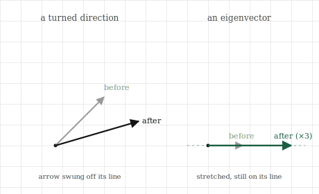

# Eigenvectors and Eigenvalues

## The itch {.unnumbered}

When a transformation acts on the plane, it does something different to almost every vector. It turns them. An arrow pointing one way gets swung to point another, its direction changed along with its length. Watch a shear or a rotation act on a fan of arrows and they all pivot, each ending up aimed somewhere new. Direction is not preserved; that is most of what a transformation does.

But not every arrow turns. For most transformations there are a few special directions that come through unturned. A vector pointing exactly along one of these special directions gets stretched or squashed, made longer or shorter, but it keeps pointing exactly the way it did. The transformation moved it along its own line without ever knocking it off that line. These survivor directions are rare, usually just one or two in the plane, and everything else pivots around them.

Those special directions are the deep structure of a transformation. They are the axes the transformation is, in a sense, built around, the directions it treats most simply, by pure stretching with no turning. If we can find them, a complicated-looking transformation resolves into something far easier to understand: along these special directions it merely scales, and its whole behaviour can be read through what it does to them. This chapter is about finding those directions and the amounts they get stretched by, because they are among the most useful things a matrix can tell us, and they are the foundation of the flagship chapter that follows.

## The picture {.unnumbered}

Take a transformation and watch what it does to arrows pointing in every direction. Nearly all of them get turned: the arrow and its transformed version point different ways, the transformation having swung it off its original line. Picture the original arrow and its image as two arrows from the origin, and for most starting directions those two make an angle, evidence that the direction was not preserved.

Now hunt for the exceptions. Is there a direction where the arrow and its transformed image still lie along the very same line? Where the transformation, whatever else it did, did not swing the arrow off course but only slid it along its own line, longer or shorter or reversed, but never turned? For most transformations such directions exist, and they are special enough to name. A direction that survives a transformation unturned is an **eigenvector** of that transformation, and the factor by which the arrow along it gets stretched is the **eigenvalue** for that direction.

{#fig-eigen width=85%}

An example makes the two ideas concrete. Consider a transformation that stretches everything horizontally by three and leaves the vertical untouched. A vector pointing straight along the horizontal axis gets tripled in length but stays horizontal: it is an eigenvector, with eigenvalue three. A vector pointing straight up is left completely alone, unmoved: it too is an eigenvector, with eigenvalue one, since it is stretched by a factor of one, which is to say not at all. But a vector pointing diagonally gets pulled flatter as its horizontal part triples and its vertical part stays put, so it ends up aimed differently than it began. The diagonal direction is turned; it is not an eigenvector. The two axes survive; the diagonal does not.

Eigenvalues carry sign and size, and both mean something plain. An eigenvalue larger than one means the eigenvector is stretched; between zero and one, it is squashed toward the origin; exactly one, it is left unchanged. A negative eigenvalue means the arrow is flipped to point backward along its own line, which still counts as unturned in the sense that matters, since it stays on the same line through the origin, just now facing the other way. And an eigenvalue of zero means the eigenvector is squashed all the way to nothing, collapsed onto the origin, which is the direction a collapsing transformation destroys.

Not every transformation has these survivor directions in the plane. A pure rotation, which turns every arrow by the same angle, turns all of them, and so has no real eigenvectors at all, no direction survives a quarter-turn unturned. This is not a flaw in the idea; it is the idea correctly reporting that a rotation preserves no direction. When survivor directions do exist, though, they expose the transformation's skeleton.

## The math, built up {.unnumbered}

The picture translates into one compact equation. An eigenvector is a vector $\mathbf{v}$ that the transformation $A$ sends to a scaled copy of itself, stretched by the eigenvalue $\lambda$ but not turned:

$$
A\mathbf{v} = \lambda \mathbf{v}.
$$

Read each side through the picture. The left side, $A\mathbf{v}$, is the transformation acting on the vector, sending it wherever it goes. The right side, $\lambda\mathbf{v}$, is the same vector merely scaled, still on its own line. The equation says these are equal: applying the whole transformation to $\mathbf{v}$ does no more than stretch it by $\lambda$. That is the entire definition, and it is just the survivor-direction idea written in symbols. Everything about eigenvectors is unpacking this one line.

There is a subtlety the equation makes clear. If $\mathbf{v}$ is an eigenvector, so is any scaling of it, because stretching a survivor direction gives another arrow on the same line, equally unturned. So eigenvectors come as whole lines, not single arrows; the direction is what matters, and we usually pick one representative arrow along it, often scaled to length one. The eigenvalue, by contrast, is a single definite number: how much that direction gets stretched, the same whichever representative we chose.

Finding eigenvectors means finding the $\mathbf{v}$ and $\lambda$ that satisfy the equation, and the route to them runs straight through the last two chapters. Rearrange the equation so one side is zero. We want $A\mathbf{v} - \lambda\mathbf{v} = \mathbf{0}$, which, treating $\lambda\mathbf{v}$ as a transformation that scales $\mathbf{v}$ by $\lambda$, becomes $(A - \lambda I)\mathbf{v} = \mathbf{0}$, where $I$ is the identity. This says the transformation $A - \lambda I$ sends the non-zero vector $\mathbf{v}$ to the origin. But a transformation that sends a non-zero vector to zero is a collapsing one, and we know its signature exactly: its determinant is zero. So the eigenvalues are precisely the numbers $\lambda$ for which

$$
\det(A - \lambda I) = 0.
$$

This is the bridge from the picture to a computation. Each $\lambda$ that makes $A - \lambda I$ collapse is an eigenvalue, and for each such $\lambda$, the directions that get sent to zero are its eigenvectors. We will not turn this into a hand procedure, solving the resulting equation for $\lambda$ and back-substituting, because for anything beyond the smallest matrices it is done by machine. What matters is that eigenvalues are the stretch factors, eigenvectors are the survivor directions, and the whole search reduces to asking when a related transformation collapses, which ties eigenvectors directly to the determinant and rank we already built.

## Build it yourself {.unnumbered}

Finding eigenvectors by hand is laborious, but NumPy does it in one call, and we can verify the survivor-direction picture directly.

Take the horizontal stretch from the picture, tripling the first axis and leaving the second:

```{python}
import numpy as np

A = np.array([[3.0, 0.0],
              [0.0, 1.0]])

values, vectors = np.linalg.eig(A)
print(values)
print(vectors)
```

The eigenvalues come back as three and one, the two stretch factors we reasoned out. The eigenvectors are returned as the columns of the second array, and they are the horizontal and vertical directions, each written as a unit-length arrow. The transformation's survivor directions are exactly the two axes, exactly as the picture promised.

Now confirm the defining property directly: applying $A$ to an eigenvector should equal simply scaling that eigenvector by its eigenvalue. Take the first eigenvector and its eigenvalue and check both sides of $A\mathbf{v} = \lambda\mathbf{v}$:

```{python}
v = vectors[:, 0]           # first eigenvector
lam = values[0]             # its eigenvalue

print(A @ v)                # the transformation acting on v
print(lam * v)              # v merely scaled by the eigenvalue
```

The two lines print the same vector. Applying the whole transformation to this direction did no more than scale it, which is what makes it an eigenvector. The arrow was not turned, only stretched.

Watch a turned direction fail the same test. A diagonal vector is not an eigenvector of this transformation, so applying $A$ to it should not give a mere scaling:

```{python}
d = np.array([1.0, 1.0])    # a diagonal direction
print(A @ d)                # becomes [3, 1]
```

The diagonal $[1, 1]$ becomes $[3, 1]$, which does not point the same way as $[1, 1]$; the direction was turned, pulled flatter. No single number scales $[1, 1]$ into $[3, 1]$, which is precisely what it means for a direction to fail to be an eigenvector.

And the rotation with no survivors behaves as the picture warned. A quarter-turn turns every direction, so it should have no real eigenvectors:

```{python}
R = np.array([[0.0, -1.0],
              [1.0,  0.0]])
print(np.linalg.eig(R).eigenvalues)
```

The eigenvalues come back as complex numbers, not real ones, which is the arithmetic's way of reporting that no real direction survives the rotation unturned. When a transformation preserves no direction, the real survivor directions simply are not there to find.

## Where it lives in ML {.unnumbered}

Eigenvectors matter in machine learning because they find the directions that matter in data, and the most important instance is a technique we have been pointing at for several chapters: principal component analysis, or PCA. Its whole job is to look at a cloud of data and find the directions along which the data varies most, the axes the data is really organised around, so that we can keep those few directions and discard the rest. Those directions of greatest variation are eigenvectors, of a particular matrix built from the data, and their eigenvalues say how much variation each one carries. PCA is, at heart, an eigenvector computation, and dimensionality reduction is keeping the eigenvectors with the largest eigenvalues and throwing away the small ones.

The reason this works is the survivor-direction idea applied to data. A dataset spread through a high-dimensional space usually has a few directions along which it stretches out a great deal and many along which it barely varies. The high-eigenvalue directions are where the information lives; the low-eigenvalue directions are nearly flat, carrying almost nothing. Reducing the data to its top few eigenvectors keeps almost all of the structure while collapsing the description from thousands of numbers to a handful. It is the low-rank hope from the independence chapter, now made actionable: the eigenvalues tell us exactly which directions are worth keeping.

Eigenvalues also diagnose the behaviour of repeated transformations, which appear throughout machine learning whenever a process is applied over and over. When a transformation is applied many times in succession, its eigenvalues govern what happens in the long run. Directions with eigenvalue larger than one grow with each application, exploding if the process runs long enough; directions with eigenvalue smaller than one shrink away to nothing. This is the mathematics behind a famous difficulty in training deep and recurrent networks, where signals passed through many layers either blow up or vanish depending on whether the relevant eigenvalues sit above or below one. The exploding and vanishing gradients that plague deep learning are, underneath, a story about eigenvalues of a repeated transformation, and understanding them starts exactly here.

There is a further appearance close to the systems this book was written alongside. The stability of many iterative methods, the way a training process either settles toward an answer or spirals away from it, is read through the eigenvalues of the transformation that each step applies. Whether a method converges is often precisely the question of whether certain eigenvalues lie inside a safe range. The survivor directions and their stretch factors, met here as a piece of geometry, turn out to decide whether some of the most important processes in the field work at all.

## Common misunderstandings {.unnumbered}

**An eigenvector is a direction, not a single arrow.** Because any scaling of an eigenvector is also an eigenvector, lying on the same unturned line, it makes no sense to speak of *the* eigenvector as one specific arrow. The eigenvector is the whole line through the origin, the direction that survives. Tools return a single representative, usually scaled to length one, but that particular arrow is a choice of representative, not the eigenvector itself. What is fixed and meaningful is the direction and its eigenvalue, not the length or sign of the arrow the computer happened to hand back.

**Not every transformation has real eigenvectors.** It is tempting to assume the survivor directions always exist, but a rotation turns every direction and preserves none, so it has no real eigenvectors at all. The computation reports this by returning complex numbers rather than real ones. This is not a failure; it is the honest answer that no real direction comes through unturned. When you expect eigenvectors and get complex values, the transformation is doing something rotational, mixing directions together rather than merely stretching along fixed axes.

**A large eigenvalue is not the same as an important eigenvector, unless the matrix is the right kind.** For the symmetric matrices that arise in PCA, built from data in a particular way, the eigenvalues genuinely rank the directions by importance, and keeping the largest is sound. But for a general matrix, an eigenvalue only tells you the stretch along its direction, and stretch is not always importance. The clean "keep the biggest eigenvalues" story belongs to the special, well-behaved matrices that dimensionality reduction uses, not to every matrix. Which is part of why the next chapter exists: it gives a version of this idea that works for *every* matrix, not only the well-behaved ones.

**Eigenvalues can be negative or zero, and both mean something specific.** A common assumption is that eigenvalues are positive stretch factors. A negative eigenvalue flips its eigenvector to point backward along the same line, still unturned in the sense that matters. A zero eigenvalue squashes its direction entirely to the origin, and its presence means the transformation collapses that direction, connecting eigenvalues straight back to the determinant: a transformation has a zero eigenvalue exactly when it collapses, exactly when its determinant is zero. Sign and zero are not edge cases to ignore; they carry the flip and the collapse.

## Check your intuition {.unnumbered}

Try each before opening the answers.

**1.** A transformation stretches the vertical axis by four and leaves the horizontal axis unchanged. What are its eigenvectors and eigenvalues?

**2.** A vector $\mathbf{v}$ satisfies $A\mathbf{v} = -2\mathbf{v}$. Is $\mathbf{v}$ an eigenvector? What does the transformation do to it, geometrically?

**3.** A transformation has an eigenvalue of zero. What does this tell you about the transformation, in the language of earlier chapters?

**4.** Why does a pure rotation of the plane have no real eigenvectors? Answer from the picture, not the arithmetic.

**5.** A process applies the same transformation over and over to a vector. One direction has eigenvalue $1.5$ and another has eigenvalue $0.5$. What happens to each component as the process runs many times?

::: {.callout-tip collapse="true"}
## Answers

**1.** The eigenvectors are the two axes. The vertical direction has eigenvalue four, since a vertical arrow is stretched fourfold while staying vertical. The horizontal direction has eigenvalue one, since a horizontal arrow is left completely unchanged, stretched by a factor of one. These two axes are the survivor directions; every other direction gets turned as its vertical part quadruples and its horizontal part stays fixed.

**2.** Yes, $\mathbf{v}$ is an eigenvector, with eigenvalue $-2$. The equation says the transformation sends $\mathbf{v}$ to $-2\mathbf{v}$, which is $\mathbf{v}$ scaled by two and flipped to point the opposite way along the same line. It is unturned in the sense that matters, staying on its own line through the origin, but it is doubled in length and reversed in direction. Negative eigenvalues are exactly this flip-and-scale.

**3.** The transformation collapses space. A zero eigenvalue means some direction is squashed entirely to the origin, which is what a collapsing, rank-deficient transformation does, and it means the determinant is zero. So a zero eigenvalue is another face of the collapse we have met as zero determinant, deficient rank, and singularity. The transformation cannot be undone, because a direction has been destroyed.

**4.** A rotation turns every arrow by the same angle. An eigenvector would have to be a direction the transformation leaves on its own line, merely stretched, but a rotation by anything other than a whole half-turn swings every direction off its line, none excepted. There is simply no arrow that a genuine rotation leaves pointing along its original line, so there are no real eigenvectors. The transformation preserves no direction, and the absence of eigenvectors reports that faithfully.

**5.** The direction with eigenvalue $1.5$ grows: each application multiplies it by $1.5$, so after many rounds it has been multiplied by $1.5$ many times over and becomes enormous. The direction with eigenvalue $0.5$ shrinks: each application halves it, so it fades toward zero. Run long enough, the growing direction dominates completely and the shrinking one all but vanishes. This is the seed of exploding and vanishing behaviour in repeated transformations, decided entirely by whether an eigenvalue sits above or below one.
:::