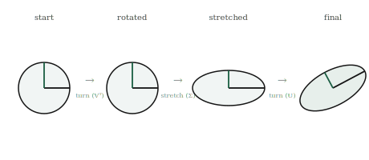

# The Singular Value Decomposition

## The itch {.unnumbered}

We ended the eigenvector chapter with an honest crack. Eigenvectors find the directions a transformation merely stretches, which is a powerful thing, but they are picky. They need square transformations, they can come out complex and refuse to point anywhere real, and even when they exist their stretch factors do not, in general, rank directions by importance. For the well-behaved matrices of PCA they work beautifully, but "well-behaved" is a real restriction, and most matrices in the world are not.

This chapter removes the restriction. It turns out that every matrix, without exception, square or not, well-behaved or not, can be broken into a sequence of the simplest possible transformations. Not just some matrices. Every single one. Whatever tangled thing a matrix does, stretching and shearing and rotating and collapsing all at once, it can always be pulled apart into three plain moves done in order: a rotation, then a stretch along perpendicular axes, then another rotation. Nothing more exotic than turning and stretching, and every transformation there is decomposes into exactly that.

This decomposition is called the singular value decomposition, and it is the most useful single result in this part of the book. It gives us, for any matrix at all, the true directions it stretches and the exact amounts, ranked cleanly from most to least. It makes the rank of a matrix visible at a glance. It powers the compression of images and data, the recommendation systems that suggest what to watch next, and the dimensionality reduction that makes high-dimensional data tractable. Everything the part has built, transformations, rank, collapse, eigenvectors, comes together here into one construction that works on everything.

## The picture {.unnumbered}

Here is the claim in full, and it is worth stating plainly because it sounds too strong to be true. Take any transformation whatsoever. However complicated its effect on space, it can always be performed in three steps: first rotate space, then stretch it along the horizontal and vertical axes by fixed amounts, then rotate again. Turn, stretch, turn. Every matrix is secretly just these three moves composed.

Walk through why that is remarkable. A general transformation can shear, can squash diagonally, can do things that seem to mix stretching and turning inseparably. The claim is that all of that apparent complexity is an illusion of viewpoint. If you rotate to the right starting orientation first, then the transformation's action becomes a plain stretch along the axes, pure scaling with no turning, and a final rotation sets the result into its true orientation. The messiness was only ever a matter of looking at the transformation in the wrong frame. Rotate into the right frame and it is simple.

{#fig-svd width=90%}

The stretch in the middle is where the important information lives. The amounts by which the middle step stretches the axes are called the **singular values** of the matrix, and they are the heart of the decomposition. Each singular value is how much the transformation stretches along one of its special perpendicular directions, and unlike eigenvalues they are always real, always present, and always ranked cleanly from largest to smallest. The largest singular value is the transformation's strongest stretch, the direction along which it pulls space out the most; the smallest is its weakest.

These singular values expose the rank we defined abstractly two chapters ago, and now we can see it. If a transformation collapses space, one of its stretch amounts is zero: the middle step squashes a direction flat rather than stretching it. So the number of non-zero singular values is exactly the rank, the number of directions that survive with real reach. A matrix that looks full but secretly has rank two shows it openly here: two non-zero singular values and the rest zero. The rank we had to compute abstractly becomes something you can read straight off the stretches.

And the ranking is what makes the decomposition so useful. Because the singular values come ordered from strongest to weakest, they tell us which directions carry most of what the transformation does, and which barely matter. A direction stretched enormously is doing most of the work; a direction stretched by almost nothing is nearly irrelevant. Keep the few strongest and discard the rest, and you have an approximation of the transformation that captures nearly all of its effect with a fraction of the information. This single idea, keep the big stretches and drop the small ones, is the engine behind compression and dimensionality reduction, and we will see it work shortly.

## The math, built up {.unnumbered}

The three moves, turn then stretch then turn, become three matrices multiplied together. Since each move is a transformation and doing them in sequence is composition, any matrix $A$ can be written as

$$
A = U \Sigma V^{T},
$$

where the three factors are exactly the three moves, read right to left as composition demands. The rightmost factor $V^{T}$ is the first rotation, turning space into the right frame. The middle factor $\Sigma$ is the stretch, and it is a particularly simple kind of matrix: zero everywhere except along its diagonal, and those diagonal entries are the singular values, the stretch amounts. The leftmost factor $U$ is the final rotation, setting the stretched result into place.

Each piece has a clean meaning, all of it built from things we already have. The columns of $V$ are the special input directions, the perpendicular set that the first rotation lines up with the axes, the directions the transformation treats simply. The columns of $U$ are where those directions end up pointing after the transformation, the output directions. And $\Sigma$ holds the singular values on its diagonal, in descending order, each one pairing an input direction from $V$ with an output direction in $U$ and recording how much that direction is stretched between them. The whole transformation is: line up the special input directions with the axes, stretch each by its singular value, and rotate into the output directions.

The rotations $U$ and $V$ have a special property worth naming, because it is what makes them pure rotations with no stretching of their own. Their columns are perpendicular unit vectors, directions all at right angles to one another and each of length one. A matrix whose columns are perpendicular unit vectors is called **orthogonal**, and an orthogonal transformation is a rigid motion: it turns space without stretching or squashing any part of it, preserving all lengths and angles. So the only stretching in the entire decomposition is quarantined into the middle factor $\Sigma$, where the singular values live. The two rotations turn; the diagonal stretches; nothing else happens.

We will not derive how the three factors are computed, which is a genuinely involved piece of numerical work, done always by machine and never by hand for any real matrix. What matters is what the decomposition means and guarantees: that it exists for every matrix without exception, that the singular values are real and ordered and expose the rank, and that the whole of a transformation's behaviour is laid out as turn, stretch, turn, with the stretches ranked from most to least important. That guarantee is what the rest of the chapter puts to work.

## Build it yourself {.unnumbered}

NumPy computes the whole decomposition in one call, and we can confirm both that it rebuilds the original matrix and that the singular values say what we claimed.

Take a matrix and decompose it:

```{python}
import numpy as np

A = np.array([[3.0, 1.0],
              [1.0, 3.0]])

U, S, Vt = np.linalg.svd(A)
print("singular values:", S)
print("U:\n", U)
print("Vt:\n", Vt)
```

The singular values come back in `S`, ordered largest first. `U` and `Vt` are the two rotations, the output directions and the transposed input directions. Notice `S` is returned as just the list of singular values, not the full diagonal matrix, since storing the zeros would be wasteful; we rebuild the diagonal when we need it.

Confirm the three moves really do reassemble the original transformation. We put the singular values onto a diagonal and multiply the three factors back together, turn then stretch then turn:

```{python}
Sigma = np.diag(S)
reconstructed = U @ Sigma @ Vt
print(reconstructed)
print(np.allclose(reconstructed, A))
```

The product returns the original matrix, and `np.allclose` confirms it, allowing for the faint floating-point dust these computations always leave. The three simple moves, composed, are exactly the matrix we started with.

Now watch the singular values expose rank. Here is a matrix that secretly collapses space, its second column twice the first:

```{python}
collapse = np.array([[1.0, 2.0],
                     [2.0, 4.0]])
U, S, Vt = np.linalg.svd(collapse)
print(S)
```

One singular value is substantial and the other is essentially zero, a speck of floating-point dust where a true zero should be. One non-zero stretch means rank one: the transformation stretches a single direction and squashes the other flat, exactly the collapse we detected before with determinant and rank, now visible as a stretch amount that fell to zero. The singular values saw the collapse the same way every other tool did.

Finally, a first taste of compression, keeping the strong stretch and discarding the weak one. We take a matrix, decompose it, and rebuild it using only its largest singular value, throwing the smaller away:

```{python}
A = np.array([[4.0, 1.0],
              [2.0, 3.0]])
U, S, Vt = np.linalg.svd(A)

# keep only the largest singular value, zero the rest
S_approx = S.copy()
S_approx[1:] = 0

approx = U @ np.diag(S_approx) @ Vt
print("original:\n", A)
print("rank-1 approximation:\n", approx)
```

The approximation is not the original, but it is a recognisable shadow of it, rebuilt from a fraction of the information by keeping only the strongest stretch. On a small two-by-two matrix the saving is trivial, but the same move on a large matrix, keeping a handful of the strongest stretches out of thousands, is exactly how images and data are compressed. The strong directions carry the picture; the weak ones were details we can afford to lose.

## Where it lives in ML {.unnumbered}

The singular value decomposition is one of the most heavily used tools in all of applied machine learning, because the move it enables, keep the strong stretches and discard the weak ones, is exactly what so much of the field needs. We can finally build principal component analysis properly, the technique we have pointed at since the independence chapter. PCA takes a cloud of data, finds the directions along which it varies most, and keeps only those. Those directions are the top singular directions of the data, and how much the data varies along each is given by the singular values. PCA is, essentially, an SVD of the data with the small singular values thrown away, which is why it reduces a thousand features to a handful while losing almost nothing: the discarded directions were the ones the data barely used.

Compression works by the same logic, applied to a single object rather than a dataset. An image is a grid of numbers, which is to say a matrix, and that matrix has an SVD. Most images have a few strong singular values carrying the broad structure and a long tail of tiny ones carrying fine detail. Keep the strongest few hundred stretches and discard the thousands of weak ones, and you can rebuild a picture nearly indistinguishable from the original using a small fraction of the numbers. The rank-one approximation we built by hand was the crudest version of this; real compression keeps more than one stretch, but the principle is identical. The strong directions are the image; the weak ones were details you can afford to lose.

Recommendation systems lean on the decomposition in a way that is almost magical when you first see it. Arrange what every user thought of every item into an enormous matrix, users down the side, items across the top, most of it blank because most people have rated almost nothing. The SVD of that sparse, gigantic matrix uncovers a small number of strong hidden directions, latent patterns of taste that explain most of the ratings, things like a leaning toward a genre that no one labelled but that falls out of the stretches. Reconstructing the matrix from its strongest singular directions fills in the blanks with startlingly good guesses about what a user would think of something they have never seen. The recommendation you get for the next thing to watch is, underneath, an SVD quietly reconstructing a missing entry.

And there is a use tied closely to the concerns this book was written alongside, in understanding and controlling what models learn. The transformations inside a trained network have singular values, and studying them reveals how the network stretches and compresses the information passing through it, which directions it amplifies and which it discards. Techniques that shrink or fine-tune large models work by keeping only the strongest singular directions of the transformations, the same keep-the-big-stretches move applied to a network's weights rather than to data. The decomposition built here is, increasingly, a tool for looking inside models and deciding what in them matters, which is close to the heart of making powerful systems safe and efficient.

## Common misunderstandings {.unnumbered}

**Singular values are not eigenvalues, though they are related.** After the last chapter it is tempting to treat the two as the same. They are not. Every matrix has singular values, always real and non-negative and ordered; only some matrices have real eigenvalues, and eigenvalues can be negative or complex. For the special well-behaved matrices where both exist, they line up closely, which is why the two get confused, but the singular value decomposition works on every matrix precisely because singular values do not carry the fragility eigenvalues do. When you need something guaranteed to exist and behave, reach for singular values.

**The decomposition is exact, not an approximation.** It is easy to come away thinking of the SVD as an approximation method, because we use it to approximate by dropping small singular values. But the full decomposition, keeping every singular value, is exact: the three moves multiply back to precisely the original matrix, to the last digit the arithmetic allows. The approximation is a separate, optional second step, throwing away the weak stretches on purpose. The decomposition itself hides nothing and loses nothing; only the deliberate truncation does.

**Small singular values are not always noise to discard.** The keep-the-strong-drop-the-weak move is powerful, but it rests on an assumption: that the weak directions carry little that matters. Usually true, sometimes badly false. In some problems the small singular values carry exactly the subtle signal you care about, and discarding them throws away the answer. Truncating is a judgement about your data, not a mechanical rule, the same lesson we met with cosine similarity and with norms: the tool does not decide for you whether the thing it removes was worth keeping.

**A matrix is not literally three matrices.** The decomposition writes $A$ as a product of three factors, but $A$ remains one transformation; the three factors are a way of *seeing* it as turn, stretch, turn, not a claim that it was secretly assembled from three separate things. This is the flip side of a fact from the composition chapter, where we noted you generally cannot recover the two matrices that were multiplied to make a product. The SVD is the remarkable exception: for this particular into-three factorisation, there is a canonical answer, always available, which is part of what makes it so valuable. Composition usually hides its factors; the SVD is where they can always be recovered.

## Check your intuition {.unnumbered}

Try each before opening the answers.

**1.** In the decomposition $A = U\Sigma V^{T}$, which factor holds the stretch amounts, and which two are pure rotations?

**2.** A matrix has singular values $5$, $3$, and $0$. What is its rank, and what does the zero tell you about the transformation?

**3.** Every matrix has a singular value decomposition, but not every matrix has real eigenvectors. Why is this a reason to prefer singular values for general work?

**4.** You compress an image by keeping only its ten largest singular values out of five hundred. What have you kept, and what have you thrown away?

**5.** A transformation's singular values are $10$, $9.8$, $9.5$, and $0.01$. Which direction could you discard with the least loss, and what does the spread of values suggest about the data?

::: {.callout-tip collapse="true"}
## Answers

**1.** The middle factor $\Sigma$ holds the stretch amounts, the singular values, along its diagonal and zeros elsewhere. The outer two factors, $U$ and $V^{T}$, are the pure rotations: $V^{T}$ turns space into the right frame first, and $U$ turns the stretched result into its final orientation. All the stretching is quarantined in the middle; the outer two only turn.

**2.** The rank is two, the number of non-zero singular values. The zero singular value means the transformation completely squashes one direction flat rather than stretching it, collapsing that dimension to nothing. So this transformation is rank-deficient, singular, non-invertible, with a zero determinant, all the faces of collapse we have gathered, now shown as a stretch amount that fell to zero. Two directions survive with real reach; the third is destroyed.

**3.** Because a tool that always exists and always behaves is safer to build on than one that sometimes fails. Eigenvectors can come out complex or fail to point anywhere real, and their stretch factors do not reliably rank importance for general matrices. Singular values are always real, always present, always ordered from strongest to weakest, for every matrix without exception. For general work, where you cannot guarantee your matrix is the well-behaved kind eigenvectors need, the singular value decomposition gives you the structure you wanted without the fragility.

**4.** You have kept the ten strongest stretches, the directions along which the image varies most, which carry its broad structure and most of its recognisable content. You have thrown away four hundred and ninety weak directions, the fine details the image barely used. The result is a recognisable version of the picture rebuilt from a fraction of the numbers, sharp enough to see clearly even though most of the information, by count, is gone. The strong directions were the picture; the discarded ones were details.

**5.** The fourth direction, with singular value $0.01$, could be discarded with almost no loss, since the transformation barely stretches it at all, so it carries almost nothing. The spread is telling: three large, close singular values and then a sudden drop to nearly zero means the data is essentially three-dimensional, spread richly through three directions and flat in the fourth. The sharp fall from $9.5$ to $0.01$ is the signature of data that lives in fewer dimensions than it appears to, exactly the low-rank structure that makes dimensionality reduction pay off.
:::